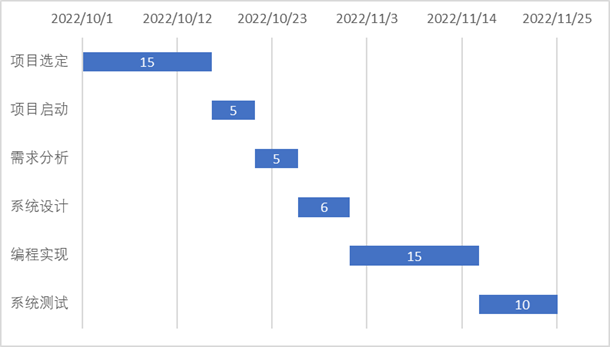
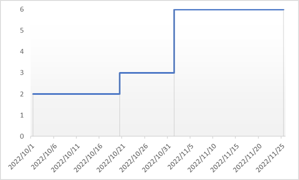

<h2>版本变更历史</h2>

| 版本号 | 作者                                               | 修订日期   | 审核者 | 审核日期   | 修订原因 |
| ------ | -------------------------------------------------- | ---------- | ------ | ---------- | -------- |
| 1.0    | 裴宇航，沈韵沨，沈轩喆， 应凌凯，吴樊，高世山 | 2022.10.14 | 裴宇航 | 2022.10.16 | 原始文档 |

<b>目录</b>

[TOC]

## 1 引言

### 1.1 编写目的

​		本计划旨在说明渔业产业地图整个项目实施过程的工作任务、人员分配、时间进度、工作规范、测试约定等安排，以便了解全局发展，调控时间进度。另外，通过项目管理策略与方法，说明如何计划、 组织和实施项目开发工作。 

### 1.2 软件系统名称

​		渔业产业地图信息可视化平台

### 1.3 相关人员及项目支持

<h5 style="color:#0487de">任务提出者</h5>

​		浙江大学软件工程管理课程任课老师 ：邵健、邹强

<h5 style="color:#0487de">开发者</h5>

​		浙江大学软件工程管理课程第六小组

<h5 style="color:#0487de">用户</h5>

​		渔业相关从业人员

<h5 style="color:#0487de">实现该软件的计算机网络</h5>

​		基于公网 IP 的服务器与 MySQL 数据库

### 1.4 读者对象

​		① 软件客户代表

​		② 项目负责人

​		③ 项目开发人员

​		④ 软件质量分析员

​		⑤ 软件维护人员

​		⑥ 其他需要了解本项目质量管理情况的人员

## 2 项目概述

### 2.1 项目背景

​		数字技术的发展和应用，使得以数字化方式将各类社会生产活动转变为可记录、可存储、可交互的数据、信息和知识成为可能，数据也由此成为新的生产资料和关键生产要素。而互联网等网络技术的发展和应用，也使抽象出来的数据、信息、知识在不同主体间流动、对接、融合，深刻改变了传统的生产方式与生产关系，大幅提升了数据处理的时效化、自动化与智能化水平。

​		在此背景下，推进产业数字化转型便成为数字时代推动高质量发展、打造数字经济新优势的主动选择。而信息可视化平台以其对数据信息的清晰呈现与直观对比，可以大幅降低信息检索成本、提升决策效率，以现代数字技术提供精确的度量分析服务，从而优化生产运营的各个环节，促进生产要素优化配置与传统生产方式变革。

​		然而，作为我国第一产业的重要组成部分的渔业在信息可视化平台上仍存在明显缺位。由于该产业具有明显的区域性和季节性特征，旧式信息检索平台的低时效性、低直观性显然已无法满足该产业的发展需求。而Web应用的灵活性与多样的数据可视化功能显然能更及时直观的对有关信息进行呈现，契合行业发展需要。

### 2.2 项目介绍

​		本项目旨在建立一个渔业信息可视化平台，为渔业从业者提供可视化渔业信息。

### 2.3 名词定义

<h5 style="color:#0487de">渔业</h5>

​		渔业是指捕捞和养殖鱼类和其他水生动物及海藻类等水生植物以取得水产品的社会生产部门。一般分为海洋渔业、淡水渔业。渔业可为人民生活和国家建设提供食品和工业原料。

<h5 style="color:#0487de">HTML</h5>

​		超文本标记语言（Hyper Text Markup Language），是标准通用标记语言下的一个应用，用于描述因特网上的网页文档。

<h5 style="color:#0487de">CSS</h5>

​		层叠样式表（Cascading Style Sheets），是一种用来表现HTML等文件样式的计算机语言，在网页中能够对网页中元素位置的排版进行像素级精确控制。

<h5 style="color:#0487de">UML</h5>

​		统一建模语言（Unified Modeling Language），是一套用来设计软件蓝图的标准建模语言，是一种从软件分析、设计到编写程序规范的标准化建模语言。

<h5 style="color:#0487de">B/S系统</h5>

​		浏览器/服务器系统。只安装维护一个服务器（Sever），而客户端采用浏览器（Browse）运行软件。

### 2.4 参考资料

1. 《软件设计文档国家标准》
2. 《软件工程项目开发文档范例》
3. 《Software Requirements (edition 2)》Karl E. Wiegers

### 2.5 产品结果

#### 2.5.1 产品

​		最终成果是一个渔业信息可视化平台，包括:

​		① 前后端代码

​		② 数据库建立代码及数据库数据

​		③ 系统开发、维护文档

​		④ 网站所需资源文件

#### 2.5.2 手册

​		验收报告以及交接手册

<h5 style="color:#0487de">用户操作手册</h5>

​		在网站和App内内建相应的引导，并做充分的友好性优化

<h5 style="color:#0487de">应用配置手册</h5>

​	提供给系统管理员及系统维护人员进行阅读，对于网站的部署方法进行说明，对于相关参数的用途进行说明，使用有一定技术的用户得以自己解决多数问题。

<h5 style="color:#0487de">软件维护手册</h5>

​		主要包括搜索引擎说明、程序模块说明、操作环境、支持软件的说明、维护过程的说明，便于维护人员对于系统的维护。

#### 2.5.3 服务

​		提供使用相应的在线客服支持。

## 3 开发进度计划

### 3.1 整体开发时间线

| 项目阶段 |        持续时间         |  负责人  | 主要工作                                       | 目标成果                                               |
| :------: | :---------------------: | :------: | ---------------------------------------------- | ------------------------------------------------------ |
| 项目选定 | 2022.10.01 - 2022.10.15 |  裴宇航  | 确定项目主题，并制定项目开发计划               | 完成《项目章程》《项目计划》                           |
| 项目启动 | 2022.10.16 - 2022.10.20 |  高世山  | 对项目可行性进行分析，并制定质量保证方案       | 完成《质量保证计划》《可行性分析报告》                 |
| 需求分析 | 2022.10.21 - 2022.10.25 |  沈轩喆  | 确定系统运行环境、系统功能及性能、系统逻辑模型 | 完成《软件需求规格说明书》                             |
| 系统设计 | 2022.10.26 - 2022.10.31 |  沈韵沨  | 进行详细系统设计                               | 完成《概要设计说明书》《详细设计说明书》               |
| 编程实现 | 2022.11.01 - 2022.11.15 | 全体人员 | 进行系统编码                                   | 得到完整的可运行代码，完成《系统开发报告》《用户手册》 |
| 系统测试 | 2022.11.16 - 2022.11.25 |   吴樊   | 对系统进行测试、部署，并完成项目总结           | 完成《测试报告》《项目总结报告》                       |

### 3.2 软件过程改进计划

#### 3.2.1 软件过程改进核心原则

​		SPI核心原则：1. 注重问题；2. 强调知识创新；3. 鼓励参与；4.领导层的统一；5.计划不断地改进。

#### 3.2.2 软件过程改进框架

<h5 style="color:#0487de">软件过程基础设施</h5>

​		版本管理工具可以为软件过程改进提供基础技术设施条件，本项目采用Git作为本地版本工具，Github作为项目托管平台及团队协作开发仓库。

<h5 style="color:#0487de">过程改进路线图</h5>

​		目标达到CMM已定义级，在有一定条件下向CMM已管理级改进。

<h5 style="color:#0487de">软件过程评估方法</h5>

​		主要通过文档进行过程评估，通过文档可以对过程改进路线图。

<h5 style="color:#0487de">软件过程改进方法</h5>

​		在前期开发中，主要采用目标驱动，根据预定目标，自顶而下制定过程评价和度量模型，有目的地开展改进活动。

​		在后期开发中（尤其是测试阶段），主要采用缺陷驱动，根据实际产生的过程缺陷反馈信息，进行有针对性的改进活动。

#### 3.2.3 软件过程改进步骤

<h5 style="color:#0487de">（1）过程分析</h5>

​		在过程改进前，需要先考察和理解现有的过程，对过程的某些环节进行度量和定量分析，利用取得的数据来呈现过程的状况。

<h5 style="color:#0487de">（2）确定改进</h5>

​		利用过程分析的结果，找出原有过程中质量、进度和成本的瓶颈。针对发现的问题，制定过程改进方案，提出需要采用什么规程、方法和工具的建议。过程改进方案需要上传组内公共文件夹。

<h5 style="color:#0487de">（3）过程变更</h5>

​		把新的规程、方法和工具安置于合适的过程环节上，与其他的软件过程活动集成起来。

<h5 style="color:#0487de">（4）培训</h5>

​		对于过程改进方案，需要由全体组员过目，让组员了解改进详情。对于重要或有难度的改进要点，要在小组会议中集中培训。

<h5 style="color:#0487de">（5）调整过程变更</h5>

​		对过程修改后出现一些小的问题进行适当调整。

### 3.3 版本更新计划

​		FE-1：查看单个渔业产业地图图层；

​		FE-2：同时查看多个渔业产业地图图层；

​		FE-3：渔业地理数据查询；

​		FE-4：渔业地理数据基本形式可视化（折线图、柱状图、饼状图）；

​		FE-5：管理员登入登出；

​		FE-6：管理员增加、修改、删除渔业产业地图数据；

​		FE-7：地图、图表、数据下载保存功能；

​		FE-8：渔业地理数据进阶形式可视化（数据区域缩放、热力图、雷达图等）；

| 特征 | 版本1    | 版本2    | 版本3    | 版本4    |
| ---- | -------- | -------- | -------- | -------- |
| FE-1 | 完全实现 |          |          |          |
| FE-2 | 完全实现 |          |          |          |
| FE-3 | 暂不实现 | 完全实现 |          |          |
| FE-4 | 暂不实现 | 完全实现 |          |          |
| FE-5 | 暂不实现 | 暂不实现 | 完全实现 |          |
| FE-6 | 暂不实现 | 暂不实现 | 完全实现 |          |
| FE-7 | 暂不实现 | 暂不实现 | 暂不实现 | 完全实现 |
| FE-8 | 暂不实现 | 暂不实现 | 暂不实现 | 完全实现 |

## 4 角色分配

| 项目角色       | 角色成员                    | 角色描述                                                     |
| -------------- | --------------------------- | ------------------------------------------------------------ |
| 质量经理       | 应凌凯                      | 确定系统运行环境，确定系统功能及性能，建立系统逻辑模型       |
| 测试经理       | 沈韵沨                      | 组织编写测试计划和测试方案， 组织系统测试；参加技术评审；    |
| 项目经理       | 裴宇航                      | 负责市场调查并根据用户的需求，确定开发何种产品，选择何种技 术、商业模式等，根据产品的生命周期，协调研发、营销、运营 等，确定和组织实施相应的产品策略 |
| 软件质量监督组 | 吴樊                        | 在预算范围内按时优质地领导项目小组完成全部项目工作内容，并 使客户满意。 |
| 开发组         | 沈轩喆(组长) + 其他全体成员 | 对质量经理以及项目经理提供项目进度与项目实际开发时的差异报 告，提出差异原因和改进方法。 |
| 测试组         | 高世山(组长) + 全体全体成员 | 负责进行编码工作与单元测试，进行系统集成，及时解决测试时出 现的bug |

## 5 软硬件资源说明

| 软硬件资源                   | 级别 | 详细配置                           | 获取方式   | 使用说明                                  |
| ---------------------------- | ---- | ---------------------------------- | ---------- | ----------------------------------------- |
| 服务器                       | 关键 | 单核2G Ubuntu18.04 带宽:1Mbps | 阿里云购买 | 开发和部署阶段使用                        |
| VS Code， IntelliJ IDEA | 关键 | 无                                 | 官网获取   | 代码编辑器、开发环境                      |
| Vue，Node.js， Java     | 关键 | 无                                 | 无         | 前端使用Vue框架， 后端使用JavaSpring |
| MySQL                        | 关键 | 无                                 | 阿里云部署 | 数据存储和索引管理                        |
| Git                          | 关键 | 无                                 | 无         | 版本控制、代码管理                        |
| 电脑、手机                   | 关键 | 无                                 | 已存在     | 真机测试                                  |

## 6 专题计划要点

### 6.1 开发人员培训计划

<h5 style="color:#0487de">培训目的</h5>

​		针对需求，进一步加强软件开发规范和软件开发过程质量，了解客户的真正需求，提高开发人员开发素质，使开发人员成为高质量的软件工程师。结合项目进行案例讨论，根据讨论过程进行评估。通过上述培训，进一步提高开发人员技术水平，扩展开发人员的技术知识面和视野。

<h5 style="color:#0487de">培训内容</h5>

​		① 前端框架Vue.js的培训

​		② 后端框架JavaSpring的培训

​		③ 编程工具培训

<h5 style="color:#0487de">培训方式</h5>

​		线下培训，主要由擅长某一内容的同学进行主讲。

### 6.2 质量保证计划

​        项目质量保证工作项目的质量保证工作由质量经理、质量保证人员及项目负责人负责，质量保证人员在项目启动后制定适用于单个项目的《质量保证计划》，并检查和督促计划的实施。

​        应按照质量保证计划的规定进行项目生存周期的各项活动，加强各阶段质量的早期评审与检查工作，项目质量保证人员参加所有的评审与检查活动。

​        在项目生存周期过程期间，各阶段责任人应按项目进展情况完成相应阶段的管理及技术文档，还需按规范及其他相关文件的要求填写相应记录，质量保证人员通过对各阶段输出的文档及记录的检查发现存在的质量问题。

### 6.3 测试计划

#### 6.3.1 静态测试

​        静态测试是指不执行程序而找出程序存在的错误，这种方法以人工的、非形式化的方法对程序进行分析和测试，不以来程序运行的测试。在测试中，找出程序中的语法错误，我们可以通过下面的清单来检查程序的评测效果。

<h5 style="color:#0487de">数组引用错误</h5>

​		引用未赋值的变量

​		数组元素下标越界

​		指针变量访问的内存空间非法

​		访问了不存在的空间 

<h5 style="color:#0487de">数据说明错误</h5>

​		数组或字符串初始化不正确

​		变量类型错误

​		变量名错误

​		变量改变错误

<h5 style="color:#0487de">计算错误</h5>

​		不同类型的变量混合计算

​		结果溢出、超出范围

​		运算符或者运算次序不对

​		整形变量使用错误或者算式非法

<h5 style="color:#0487de">逻辑错误</h5>

​		控制流程错误

​		循环不终止，即死循环

​		入口条件不正确

​		复合语句不正确

<h5 style="color:#0487de">接口错误</h5>

​		调用模块以及预备调用模块之间的参数个数、顺序、类型不匹配

​		模块之间传送的变量、范围、单位定义不一样

​		函数、过程和子程序调用的实参和形参个数、类型、顺序不匹配

​		子程序结果返回错误

<h5 style="color:#0487de">输入输出错误</h5>

​	   输入非法语句

​	   忘记检测输入有效性

​	   非法文件输入

​	   错误文件输出

​	   结果输出错误

<h5 style="color:#0487de">其他错误</h5>

​		程序功能遗漏

​		程序逻辑错误

​		防止注入型攻击

​        经过和以上错误清单的比较，我们不断修改源程序的语法和逻辑错误，进一步完善程序功能，这一阶段，我们还要规范程序的格式，添加必要的注释，使程序结构变的清晰、层次分明，以便其他开发人员的理解、开发、维护和修改。

#### 6.3.2 单元测试

​       单元测试就是指被测试程序是单个子程序、过程的逻辑测试，我们的任务实验整体功能和接口说明是否有不符合规定的情况，以及编码是否有错。经过静态测试后，要注意测试每一个单元，在输入输出的测试案例上进行调整，这一次的测试重要对于单元进行整理，而非系统整体测试。

​       在这一块测试中，需要对于各单位做内部逻辑检测，分模块进行，具体请见测试案例。

#### 6.3.3 联合测试

​       单元测试之后，需要在单元测试基础上把，每个单元按照设计要求逐步连接起来，进行联合测试搭建整体的教学管理系统，我们主要是将各模块拼接起来中，进行接口的数据的类型和顺序的匹配。

## 7 投资估算

### 7.1 成本估算

#### 7.1.1 时间&人力成本

 

​		Total effort: $20\times2+11\times3+25\times6=223$ staff-days

#### 7.1.2 其他成本

+ 学习成本
  + 注重基于大家已经掌握的技术进行分工，降低学习成本
  + 每人掌握至少一项技术
+ 服务器租赁成本
  + 约160元/3月
+ 运维成本
+ 数据成本
  + 可从中国工程科技知识中心获得
+ 开发工具成本
  + 已拥有，暂无成本

### 7.2 成本管理策略

​		① 应尽量按照预估成本进行支出

​		② 支出应由组内同学超过半数以上投票通过才能支付。

​		③ 任何付款应留存发票，付款发票统一上传至钉钉群内。
