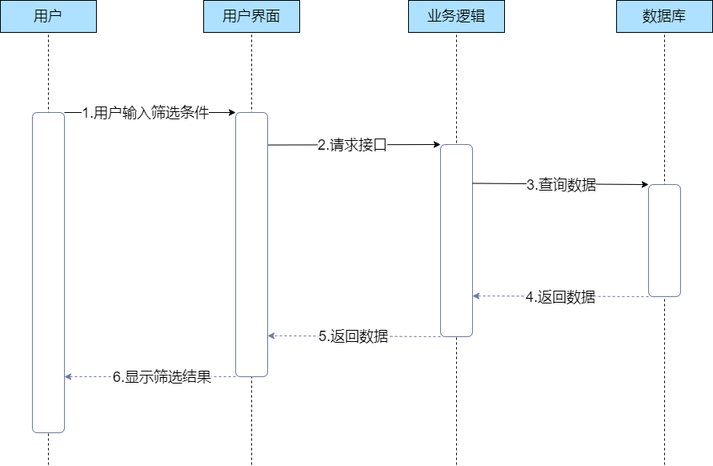
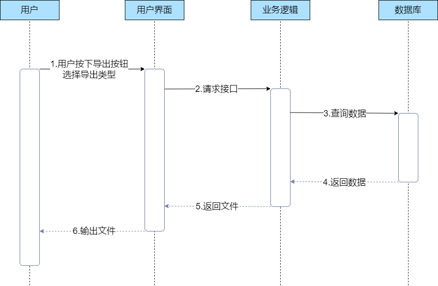

#### 4.1.4 用户筛选数据

##### 用例描述

表 1-4：用户筛选数据用例描述

| 用例编号     | UC-TC-04                                                     |
| ------------ | ------------------------------------------------------------ |
| 用例名称     | 用户筛选数据                                                 |
| 创建人       | 沈轩喆                                                       |
| 最后修改人   | 沈轩喆                                                       |
| 创建日期     | 2022/10/26                                                   |
| 最后修改日期 | 2022/10/26                                                   |
| 角色         | 用户                                                         |
| 需求来源     | 用户调研                                                     |
| 主要参与者   | 用户                                                         |
| 描述         | 用户点击筛选按钮，设置好筛选条件，系统显示筛选的结果         |
| 前置条件     | 1.  系统正常运行 2. 用户可正常打开相关界面              |
| 触发器       | 用户点击筛选按钮                                             |
| 后置条件     | 前后端交互正常                                               |
| 输入信息     | 用户设置的筛选条件                                           |
| 主干过程     | 1.  用户进入数据界面 2. 用户点击筛选按钮 3. 用户输入筛选条件 |
| 分支过程     | 无                                                           |
| 异常         | 1.  用户无法正常获取数据 2. 用户点击筛选按钮后无响应 3. 用户输入的筛选条件存在语法错误 处理：用户刷新页面，重新输入筛选条件，若仍存在异常则联系管理员处理 |
| 假设         | 无异常发生                                                   |
| 输入         | 筛选条件：condition                                          |
| 输出         | 筛选结果                                                     |
| 包括用例     | 无                                                           |
| 优先级       | 中                                                           |
| 使用频率     | 高                                                           |
| 备注与问题   | 无                                                           |

##### 时序图

图 1-7：用户筛选数据时序图

##### 活动图

图 1-8：用户筛选数据活动图

#### 4.1.5 用户导出数据

##### 用例描述

表 1-5：用户导出数据用例描述

| 用例编号     | UC-TC-05                                                     |
| ------------ | ------------------------------------------------------------ |
| 用例名称     | 用户导出数据                                                 |
| 创建人       | 沈轩喆                                                       |
| 最后修改人   | 沈轩喆                                                       |
| 创建日期     | 2022/10/26                                                   |
| 最后修改日期 | 2022/10/26                                                   |
| 角色         | 用户                                                         |
| 需求来源     | 用户调研                                                     |
| 主要参与者   | 用户                                                         |
| 描述         | 用户点击导出按钮，系统生成选择的类型的文件                   |
| 前置条件     | 1.  系统正常运行 2. 用户可正常打开相关界面              |
| 触发器       | 用户点击导出按钮，选择导出的文件类型                         |
| 后置条件     | 前后端交互正常                                               |
| 输入信息     | 用户选择的文件类型                                           |
| 主干过程     | 1.  用户进入数据界面 2. 用户点击导出按钮 3. 用户选择导出的文件类型 |
| 分支过程     | 无                                                           |
| 异常         | 1.  用户无法正常获取数据 2. 用户点击导出按钮后无响应 3. 用户选择文件类型时无响应 处理：用户刷新页面，若仍存在异常则联系管理员处理 |
| 假设         | 无异常发生                                                   |
| 输入         | 文件类型：outputType                                         |
| 输出         | 所选类型的文件                                               |
| 包括用例     | 无                                                           |
| 优先级       | 中                                                           |
| 使用频率     | 高                                                           |
| 备注与问题   | 无                                                           |

##### 时序图

图 1-9：用户导出数据时序图

##### 活动图

图 1-10：用户导出数据活动图

