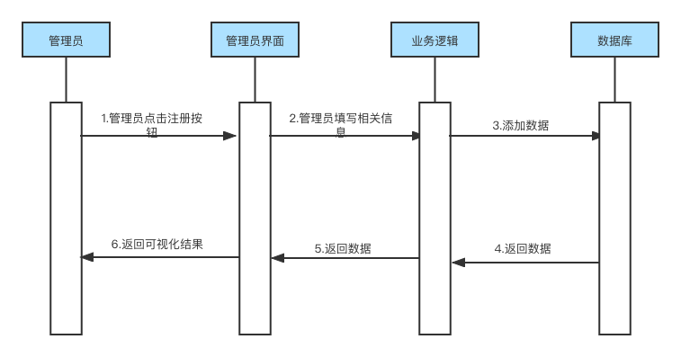
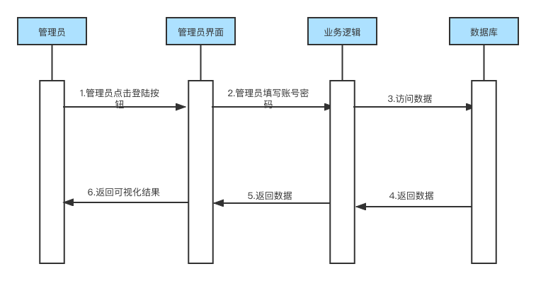
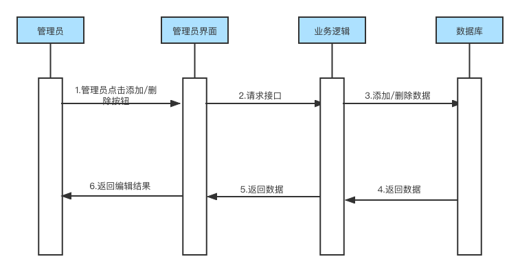
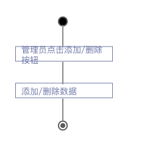

### 4.2 管理员

#### 4.2.1 管理员注册

##### 用例描述

表 2-1：管理员注册用例描述

| 用例编号：UC-TC-06   | 用例名称：管理员注册                                         |
| -------------------- | ------------------------------------------------------------ |
| 创建人：应凌凯       | 最后修改人：应凌凯                                           |
| 创建日期：2022/10/22 | 最后修改日期：2022/10/27                                     |
| 角色：管理员         | 主要参与者：管理员                                           |
| 需求来源             | 管理员调研                                                   |
| 描述                 | 管理员点击注册按钮后，可以进行相关信息的注册                 |
| 前置条件             | 1.系统正常运行 2.管理员可以正常打开相关界面             |
| 触发器               | 管理员点击注册按钮                                           |
| 后置条件             | 前后端交互正常                                               |
| 输入信息             | 管理员自身基本信息以及设置的账号密码                         |
| 主干过程             | 1.管理员进入注册界面 2.管理员填写相关信息 3.管理员点击注册按钮 |
| 分支过程             | 无                                                           |
| 异常                 | 1.管理员无法正常进入注册页面 2.管理员填写完信息后系统无响应 3.管理员输入信息不合规定 4.管理员点击注册按钮后系统无响应 |
| 假设                 | 无异常发生                                                   |
| 输入                 | 数据源信息：type                                             |
| 输出                 | 数据可视化界面                                               |
| 包括用例             | 无                                                           |
| 优先级               | 高                                                           |
| 使用频率             | 高                                                           |
| 备注与问题           | 无                                                           |

##### 时序图

图 2-1：管理员注册时序图

##### 活动图

图 2-2：管理员注册活动图

#### 4.2.2管理员登陆

##### 用例描述

表 2-2：管理员登陆用例描述

| 用例编号：UC-TC-07   | 用例名称：管理员登陆                                         |
| -------------------- | ------------------------------------------------------------ |
| 创建人：应凌凯       | 最后修改人：应凌凯                                           |
| 创建日期：2022/10/22 | 最后修改日期：2022/10/27                                     |
| 角色：管理员         | 主要参与者：管理员                                           |
| 需求来源             | 管理员调研                                                   |
| 描述                 | 管理员点击登陆按钮后，可以进入管理页面                       |
| 前置条件             | 1.系统正常运行 2.管理员可以正常打开相关界面             |
| 触发器               | 管理员点击登陆按钮                                           |
| 后置条件             | 前后端交互正常                                               |
| 输入信息             | 管理员自己的账号密码                                         |
| 主干过程             | 1.管理员进入登陆界面 2.管理员填写自己的账号密码 3.管理员点击登陆按钮 |
| 分支过程             | 无                                                           |
| 异常                 | 1.管理员无法正常进入登陆页面 2.管理员填写完账号密码后系统无响应 3.管理员输入账号密码错误 4.管理员点击登陆按钮后系统无响应 |
| 假设                 | 无异常发生                                                   |
| 输入                 | 数据源信息：type                                             |
| 输出                 | 数据可视化界面                                               |
| 包括用例             | 无                                                           |
| 优先级               | 高                                                           |
| 使用频率             | 高                                                           |
| 备注与问题           | 无                                                           |

##### 时序图

图 2-3：管理员登陆时序图

##### 活动图

图 2-4：管理员登陆活动图

#### 4.2.3 管理员增删改数据

##### 用例描述

表 1-3：管理员增删改数据用例描述

| 用例编号：UC-TC-08   | 用例名称：管理员增删改数据                                   |
| -------------------- | ------------------------------------------------------------ |
| 创建人：应凌凯       | 最后修改人：应凌凯                                           |
| 创建日期：2022/10/22 | 最后修改日期：2022/10/27                                     |
| 角色：管理员         | 主要参与者：管理员                                           |
| 需求来源             | 管理员调研                                                   |
| 描述                 | 管理员对待显示的数据源进行增加或删除操作                     |
| 前置条件             | 1.系统正常运行  2.管理员可以正常打开相关界面            |
| 触发器               | 管理员点击添加/删除按钮                                      |
| 后置条件             | 前后端交互正常                                               |
| 输入信息             | 收到影响的数据源种类、操作类型（添加或删除）                 |
| 主干过程             | 1.管理员进入数据可视化结果页面 2.管理员点击删除按钮     |
| 分支过程             | 1.管理员进入数据可视化结果界面 2.管理员点击添加按钮 3.管理员选择添加的数据源 |
| 异常                 | 1.管理员点击删除/添加数据后系统无响应                        |
| 假设                 | 无异常发生                                                   |
| 输入                 | 受影响的数据源信息：type，操作种类：operation                |
| 输出                 | 待显示的数据源列表                                           |
| 包括用例             | 无                                                           |
| 优先级               | 低                                                           |
| 使用频率             | 中                                                           |
| 备注与问题           | 无                                                           |

##### 时序图

图 1-5：管理员增删改数据时序图

##### 活动图

图 1-6：管理员增删改数据活动图
