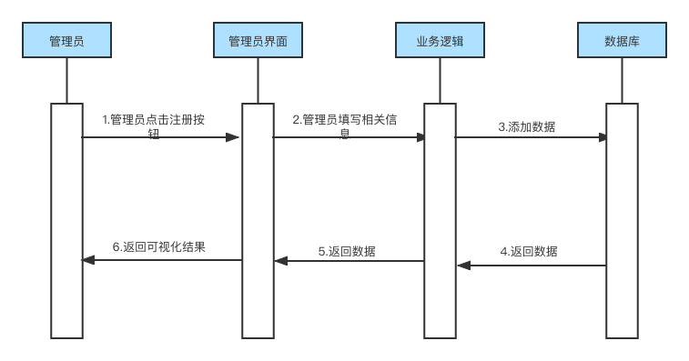

<h2>版本变更历史</h2>

| 版本号 | 作者                                               | 修订日期   | 审核者 | 审核日期   | 修订原因                         |
| ------ | -------------------------------------------------- | ---------- | ------ | ---------- | -------------------------------- |
| 1.0    | 裴宇航，沈韵沨，沈轩喆， 应凌凯，吴樊，高世山 | 2022.10.28 | 裴宇航 | 2022.10.28 | 原始文档                         |
| 2.0    | 裴宇航，沈韵沨，沈轩喆， 应凌凯，吴樊，高世山 | 2022.11.16 | 裴宇航 | 2022.11.19 | 对第3部分、第7部分 进行完善 |

<b>目录</b>

[TOC]

## 1 引言

​		引言提出了对软件需求规格说明的纵览，希望能帮助读者理解本文档是如何编写，并如何阅读和解释。

### 1.1 目的

​		在完成针对“渔业产业地图信息可视化平台”的前期调查，同时与多位项目用户代表进行了全面深入地探讨和分析的基础上，提出这份软件需求规格书。

​		此需求规格说明书对“渔业产业地图信息可视化平台”做了全面细致的用户需求分析，明确了本系统应具有的概貌、功能要求、性能分析、运行要求等，并尽可能完整地描述系统预期的外部行为和用户可视化行为，使系统分析人员及软件开发人员能清楚地了解用户需求，并在此基础上进一步提出概要设计说明书和完成后续设计与开发工作。

### 1.2 文档约定

​		本部分描述编写文档时采用的标准或排版约定，包括撰写软件、正文风格、表格格式、提示区和重要符号等。

##### 采用标准

​		编写文档采用的标准为IEEE_830-1998版本软件需求规格说明书，部分内容根据项目实际情况进行调整或删减。

##### 撰写软件

​		文档由Typora的Markdown统一撰写，并以pdf格式存储。

##### 排版约定

| 格式   | 字体      | 字号 | 加粗 | 斜体 | 下划线 |
| ------ | --------- | ---- | ---- | ---- | ------ |
| 标题   | Open Sans | 48   | 否   | 否   | 否     |
| 副标题 | Open Sans | 小二 | 否   | 否   | 否     |
| 标题1  | Open Sans | 28   | 是   | 否   | 否     |
| 标题2  | Open Sans | 20   | 是   | 否   | 否     |
| 标题3  | Open Sans | 18   | 是   | 否   | 否     |
| 标题4  | Open Sans | 16   | 是   | 否   | 否     |
| 正文   | Open Sans | 16   | 否   | 否   | 否     |
| 引用   | Open Sans | 14   | 否   | 否   | 否     |

### 1.3 预期读者和阅读建议

​		此部分列举了该软件需求规格说明书所针对的目标读者群，并且针对不同的读者提出了相应的阅读建议。

##### 读者范围

​		此说明书的预期读者群为：客户、业务分析员、需求分析员、用户文档编写人员、测试人员和项目管理人员。

##### 阅读建议

|                                   | 管理人员           | 客户               | 用户               | 需求分析员         | 测试人员           | 文档编写人员       |
| --------------------------------- | ------------------ | ------------------ | ------------------ | ------------------ | ------------------ | ------------------ |
| 
引言
             | 
√
 | 
√
 | 
√
 | 
√
 | 
√
 | 
√
 |
| 
产品概述
         | 
√
 | 
√
 |                    | 
√
 | 
√
 | 
√
 |
| 
系统需求分析概述
 | 
√
 | 
√
 |                    | 
√
 |                    | 
√
 |
| 
功能需求
         | 
√
 | 
√
 | 
√
 | 
√
 | 
√
 | 
√
 |
| 
其他非功能需求
   | 
√
 | 
√
 |                    | 
√
 | 
√
 | 
√
 |
| 
外部接口需求
     | 
√
 | 
√
 | 
√
 | 
√
 | 
√
 | 
√
 |
| 
其他需求
         | 
√
 | 
√
 | 
√
 | 
√
 | 
√
 | 
√
 |
| 
术语表
           |                    | 
√
 |                    | 
√
 |                    | 
√
 |
| 
待解决问题列表
   | 
√
 | 
√
 | 
√
 | 
√
 |                    | 
√
 |

### 1.4 参考文献

[1] 《软件工程——实践者的研究方法》, Roger S.Pressman, 机械工业出版社

[2] 《软件需求（第三版）》, Karl Wiegers，Joy Beatty, 清华大学出版社

[3] 《软件工程开发国家标准》

[4] “在线教学辅助系统” G04-1-项目章程

[5] “在线教学辅助系统” G04-2-项目计划

[6] “在线教学辅助系统” G04-3-软件需求规格说明书 

## 2 产品概述

​		这一部分概述了正在定义的产品，以及该产品所运行的环境、使用该产品的用户群体和已知的限制、假设和依赖。

### 2.1 基本信息

##### 产品名称

​		"渔我所欲"渔业产业地图信息可视化平台

##### 开发团队

​		软件工程管理课程第6小组

##### 用户群体

​		平台管理员、普通用户

##### 功能

​		使用指南、渔业信息检索、渔业信息筛选、渔业信息导出、渔业信息地图化、渔业数据可视化、自定义数据图层

##### 性能

​		至少能支持500名普通用户并发使用

##### 完成期限

​		软件工程管理课程结束前

### 2.2 开发背景

​		数字技术的发展和应用，使得以数字化方式将各类社会生产活动转变为可记录、可存储、可交互的数据、信息和知识成为可能，数据也由此成为新的生产资料和关键生产要素。而互联网等网络技术的发展和应用，也使抽象出来的数据、信息、知识在不同主体间流动、对接、融合，深刻改变了传统的生产方式与生产关系，大幅提升了数据处理的时效化、自动化与智能化水平。

​		在此背景下，推进产业数字化转型便成为数字时代推动高质量发展、打造数字经济新优势的主动选择。而信息可视化平台以其对数据信息的清晰呈现与直观对比，可以大幅降低信息检索成本、提升决策效率，以现代数字技术提供精确的度量分析服务，从而优化生产运营的各个环节，促进生产要素优化配置与传统生产方式变革。

### 2.3 业务机遇

​		作为我国第一产业的重要组成部分的渔业在信息可视化平台上仍存在明显缺位。由于该产业具有明显的区域性和季节性特征，旧式信息检索平台的低时效性、低直观性显然已无法满足该产业的发展需求。而Web应用的灵活性与多样的数据可视化功能显然能更及时直观的对有关信息进行呈现，契合行业发展需要。

​		因此，渔业信息可视化平台的开发是十分必要的，且对于助力渔业发展具有重大意义。

### 2.4 应用前景

​		“渔业信息可视化平台”旨在以直观、高效的方式为用户呈现实时渔业数据。同时，该平台支持信息的检索、筛选与导出，便于用户导出数据以辅助投资等决策工作的开展，具有一定商业价值。此外，本平台整合了来自多个权威数据源的渔业信息，确保了信息的真实性与有效性，使得从业者能够高效的完成对信息的检索，且免受虚假信息的困扰。

### 2.5 项目目标

##### 功能

​		该产品应至少为用户提供以下功能：

* 渔业信息的检索与筛选
* 渔业信息可视化数据的导出（表格/图片形式)
* 渔业信息可视化（多图层地图/图表）
* 用户使用指南

##### 性能

​		该产品应至少支持500名普通用户并发使用

### 2.6 面向群体

​		本产品主要面向的用户群体为渔业从业者，以及希望获取相关渔业信息的广大网络用户。

### 2.7 产品功能简述

​		“渔业信息可视化平台”作为网站，为其用户群体提供以下功能：

1. 通过地图数据对产业分布信息进行概览
2. 通过地图数据对水产种质资源保护区分布信息进行概览
3. 通过地图数据对历年渔业贸易数据进行概览
4. 通过鼠标交互获取较小区域的详细产业信息
5. 自主添加或移除图层
6. 对数据进行检索
7. 对数据进行筛选
8. 将指定数据导出为图像
9. 将指定数据导出为表格

### 2.8 产品开发流程图

图 2-1 产品开发流程图

### 2.9 产品范围

#### 2.9.1 上下文图

 图 2-2 上下文图

​		在上下文图中，主要对象是网站访问者与管理员。图中展示了对象与渔业产业地图可视化平台之间的交互。按照需求，网站访问者与平台的交互主要是选择数据来渲染出产业地图，管理员主要负责管理网站的数据。

#### 2.9.2 预期实现版本规划

 表 2-1 预期实现版本规划 

|     需求项     |          类别          | 预期实现版本 |
| :------------: | :--------------------: | :----------: |
|    信息发布    | Stakeholder/User Need  |     1.0      |
|    地图显示    | Stakeholder/User  Need |     1.0      |
|   多图层显示   | Stakeholder/User Need  |     2.0      |
| 自定义显示选项 | Stakeholder/User  Need |     3.0      |
|    权限管理    | Stakeholder/User  Need |     1.0      |
|  网站整体设计  |     Design Element     |     1.0      |
|    使用测试    |      Test  Suite       |     3.0      |
|    网站部署    |        Feature         |     4.0      |

### 2.10 设计和实现上的限制

 表 2-2 设计与实现的限制描述 

| 限制编号 |                   限制描述                   |
| :------: | :------------------------------------------: |
|   LI-1   |             网站不支持过高的负载             |
|   LI-2   | 网站数据来源有限，需要更多权威统计机构的支持 |
|   LI-3   |         数据、图层过多时渲染速度下降         |

### 2.11 假设和依赖

 表 2-3 假设与依赖关系 

| 假设与依赖编号 |               假设与依赖描述               |
| :------------: | :----------------------------------------: |
|      AS-1      | 该平台可以访问中国工程科技知识中心的数据库 |
|      AS-2      |       平台访问者掌握基本的计算机操作       |
|      AS-3      |    开发团队对于网站前后端开发有一定基础    |

### 2.12 开发、测试和运行环境

##### 开发环境

​		Windows10系统（Vue.js+MySQL+Spring）

​		Mac OS系统（Vue.js+MySQL+Spring）

##### 测试环境

​		服务器：Windows10系统，Mac OS系统

​		客户端：云服务器、联网的PC

## 3 系统需求分析概述

### 3.1 需求优先级分析

​		本需求优先级分析根据模块风险-价值四象限矩阵进行评级，即按照以下表格所示的四象限对需求进行优先级分类。

表 3-1 风险-价值四象限矩阵

|                             | 高价值                    | 低价值                    |
| --------------------------- | ------------------------- | ------------------------- |
| 
**高风险**
 | 
首先处理
 | 
避免
     |
| 
**低风险**
 | 
其次处理
 | 
最后处理
 |

​		考虑到实际情况的限制，以下估算仅作为策略性指导，随着项目的进行可能会进行调整。

表 3-2 需求优先级分析表

| 用例编号 | 用例名称             | 风险 | 价值 | 优先级 |
| -------- | -------------------- | ---- | ---- | ------ |
| UC-TC-01 | 用户概览产业地图信息 | 中   | 高   | 高     |
| UC-TC-02 | 用户编辑图层         | 中   | 中   | 中     |
| UC-TC-03 | 用户检索数据         | 高   | 高   | 中     |
| UC-TC-04 | 用户筛选数据         | 高   | 中   | 低     |
| UC-TC-05 | 用户导出数据         | 中   | 中   | 中     |
| UC-TC-06 | 管理员注册           | 中   | 低   | 低     |
| UC-TC-07 | 管理员登录           | 高   | 低   | 低     |
| UC-TC-08 | 管理员增删改数据     | 高   | 高   | 高     |

### 3.2 用户分析

#### 3.2.1 总用例图

 图 3-1 总用例图

#### 3.2.2 用户需求分析图

 图 3-2 用户需求分析图

#### 3.2.3 系统模块架构图

 图 3-3 系统模块架构图

#### 3.2.4 E-R图

 图 3-4 E-R图

#### 3.2.5 数据上下文

 图 3-5 数据上下文

#### 3.2.6 数据字典

##### 用户搜索数据

表 3-3 用户搜索的数据字典

| 数据元素 |      描述      | 数据类型  | 数据长度 |     数据取值     |
| :------: | :------------: | :-------: | :------: | :--------------: |
| 搜索内容 |   搜索关键词   |  字符串   |  0-50位  | 0~9, a~z, A~Z, … |
| 词条内容 | 返回的数据内容 | entry对象 |    1     |     json数据     |

##### 搜索过程中的词条

表 3-4 搜索过程的数据字典

| 数据元素 |     描述     | 数据类型 | 数据长度 |     数据取值      |
| :------: | :----------: | :------: | :------: | :---------------: |
|    IP    | 用户的IP地址 |  字符串  |  0-50位  |      0~9, .       |
|   name   | 访问的数据名 |  字符串  |  1-50位  | 0~9,  a~z, A~Z, … |
|   内容   |   数据内容   |  字符串  |  0-50位  | 0~9, a~z, A~Z, …  |

##### 数据详细信息

表 3-5 数据详细信息的数据字典

| 数据元素 |   描述   | 数据类型 | 数据长度 |     数据取值     |
| :------: | :------: | :------: | :------: | :--------------: |
|   名称   |  数据名  |  字符串  |  0-50位  | 0~9, a~z, A~Z, … |
|    id    |  数据id  |   整数   |  1-10位  |       0-9        |
|   内容   | 数据内容 |  字符串  |  0-50位  | 0~9, a~z, A~Z, … |

#### 3.2.7 数据流图

 图 3-6 用户数据流图

 图 3-7 第0层查询

 图 3-8 第0层查询地图

 图 3-9 第0层新建图层

#### 3.2.8 QFD

| 用例编号 | 用例名称             | 价值 | 未完成带来的损失 | 成本 | 风险 | 优先级 |
| -------- | -------------------- | ---- | ---------------- | ---- | ---- | ------ |
| UC-TC-01 | 用户概览产业地图信息 | 10   | 10               | 8    | 5    | 高     |
| UC-TC-02 | 用户编辑图层         | 7    | 5                | 7    | 5    | 中     |
| UC-TC-03 | 用户检索数据         | 8    | 8                | 7    | 8    | 中     |
| UC-TC-04 | 用户筛选数据         | 7    | 7                | 7    | 8    | 低     |
| UC-TC-05 | 用户导出数据         | 6    | 5                | 5    | 5    | 中     |
| UC-TC-06 | 管理员注册           | 5    | 5                | 3    | 5    | 低     |
| UC-TC-07 | 管理员登陆           | 5    | 5                | 3    | 9    | 低     |
| UC-TC-08 | 管理员增删改数据     | 10   | 10               | 5    | 10   | 高     |

## 4 功能需求

### 4.1 用户

图 4-1 用户总用例图

#### 4.1.1 用户概览产业地图信息

##### 用例描述

表 4-1 用户概览产业地图信息用例描述

| 用例编号：UC-TC-01   | 用例名称：用户概览产业地图信息                               |
| -------------------- | ------------------------------------------------------------ |
| 创建人：沈韵沨       | 最后修改人：沈韵沨                                           |
| 创建日期：2022/10/21 | 最后修改日期：2022/10/23                                     |
| 角色：用户           | 主要参与者：用户                                             |
| 需求来源             | 用户调研                                                     |
| 描述                 | 用户点击显示按钮后，系统以地图形式可视化显示数据             |
| 前置条件             | 1.系统正常运行 2.用户可以正常打开相关界面               |
| 触发器               | 用户点击显示按钮                                             |
| 后置条件             | 前后端交互正常                                               |
| 输入信息             | 用户选定的源数据种类                                         |
| 主干过程             | 1.用户进入数据检索页 2.用户选定待显示的源数据 3.用户点击显示按钮 |
| 分支过程             | 无                                                           |
| 异常                 | 1.用户无法正常进入网站主页 2.用户选取源数据后系统无响应 3.用户取消数据图层显示后系统无响应 4.用户点击显示按钮后系统无响应 处理：用户进行刷新，若仍存在异常则联系管理员进行解决 |
| 假设                 | 无异常发生                                                   |
| 输入                 | 数据源信息：type                                             |
| 输出                 | 数据可视化结果界面                                           |
| 包括用例             | 无                                                           |
| 优先级               | 高                                                           |
| 使用频率             | 高                                                           |
| 备注与问题           | 无                                                           |

##### 时序图

图 4-2 用户概览产业地图信息时序图

##### 活动图

图 4-3 用户概览产业地图信息活动图

#### 4.1.2 用户编辑图层

##### 用例描述

表 4-2 用户编辑图层用例描述

| 用例编号：UC-TC-02   | 用例名称：用户编辑图层                                       |
| -------------------- | ------------------------------------------------------------ |
| 创建人：沈韵沨       | 最后修改人：沈韵沨                                           |
| 创建日期：2022/10/21 | 最后修改日期：2022/10/23                                     |
| 角色：用户           | 主要参与者：用户                                             |
| 需求来源             | 用户调研                                                     |
| 描述                 | 用户对待显示的数据源进行增加或删除操作                       |
| 前置条件             | 1.系统正常运行  2.用户可以正常打开相关界面              |
| 触发器               | 用户点击添加/删除按钮                                        |
| 后置条件             | 前后端交互正常                                               |
| 输入信息             | 收到影响的数据源种类、操作类型（添加或删除）                 |
| 主干过程             | 1.用户进入数据可视化结果页面 2.用户点击删除按钮         |
| 分支过程             | 1.用户进入数据可视化结果界面 2.用户点击添加按钮 3.用户选择添加的数据源 |
| 异常                 | 1.用户点击删除/添加页面后系统无响应 2.用户选取新增数据源后系统无响应 处理：用户进行刷新，若仍存在异常则联系管理员进行解决 |
| 假设                 | 无异常发生                                                   |
| 输入                 | 受影响的数据源信息：type，操作种类：operation                |
| 输出                 | 待显示的数据源列表                                           |
| 包括用例             | 无                                                           |
| 优先级               | 低                                                           |
| 使用频率             | 中                                                           |
| 备注与问题           | 无                                                           |

##### 时序图

图 4-4 用户编辑图层时序图

##### 活动图

图 4-5 用户编辑图层活动图

#### 4.1.3 用户检索数据

##### 用例描述

表 4-3 用户检索数据用例描述

| 用例编号：UC-TC-03   | 用例名称：用户检索数据                                       |
| -------------------- | ------------------------------------------------------------ |
| 创建人：沈韵沨       | 最后修改人：沈韵沨                                           |
| 创建日期：2022/10/21 | 最后修改日期：2022/10/23                                     |
| 角色：用户           | 主要参与者：用户                                             |
| 需求来源             | 用户调研                                                     |
| 描述                 | 用户通过分类目录索引选取待显示的数据源                       |
| 前置条件             | 1.系统正常运行  2.用户可以正常打开相关界面              |
| 触发器               | 用户点击检索按钮                                             |
| 后置条件             | 前后端交互正常                                               |
| 输入信息             | 无                                                           |
| 主干过程             | 1.用户进入网站主页 2.用户点击检索按钮                   |
| 分支过程             | 无                                                           |
| 异常                 | 1.用户无法正常进入网站主页 2.用户点击检索按钮后系统无响应 处理：用户进行刷新，若仍存在异常则联系管理员进行解决 |
| 假设                 | 无异常发生                                                   |
| 输入                 | 无                                                           |
| 输出                 | 所有数据源的分类目录索引界面                                 |
| 包括用例             | 无                                                           |
| 优先级               | 高                                                           |
| 使用频率             | 高                                                           |
| 备注与问题           | 无                                                           |

##### 时序图

图 4-6 用检索数据时序图

##### 活动图

图 4-7 用户检索数据活动图

#### 4.1.4 用户筛选数据

##### 用例描述

表 4-4 用户筛选数据用例描述

| 用例编号     | UC-TC-04                                                     |
| ------------ | ------------------------------------------------------------ |
| 用例名称     | 用户筛选数据                                                 |
| 创建人       | 沈轩喆                                                       |
| 最后修改人   | 沈轩喆                                                       |
| 创建日期     | 2022/10/26                                                   |
| 最后修改日期 | 2022/10/26                                                   |
| 角色         | 用户                                                         |
| 需求来源     | 用户调研                                                     |
| 主要参与者   | 用户                                                         |
| 描述         | 用户点击筛选按钮，设置好筛选条件，系统显示筛选的结果         |
| 前置条件     | 1.  系统正常运行 2. 用户可正常打开相关界面              |
| 触发器       | 用户点击筛选按钮                                             |
| 后置条件     | 前后端交互正常                                               |
| 输入信息     | 用户设置的筛选条件                                           |
| 主干过程     | 1.  用户进入数据界面 2. 用户点击筛选按钮 3. 用户输入筛选条件 |
| 分支过程     | 无                                                           |
| 异常         | 1.  用户无法正常获取数据 2. 用户点击筛选按钮后无响应 3. 用户输入的筛选条件存在语法错误 处理：用户刷新页面，重新输入筛选条件，若仍存在异常则联系管理员处理 |
| 假设         | 无异常发生                                                   |
| 输入         | 筛选条件：condition                                          |
| 输出         | 筛选结果                                                     |
| 包括用例     | 无                                                           |
| 优先级       | 中                                                           |
| 使用频率     | 高                                                           |
| 备注与问题   | 无                                                           |

##### 时序图

图 4-8 用户筛选数据时序图

##### 活动图

图 4-9 用户筛选数据活动图

#### 4.1.5 用户导出数据

##### 用例描述

表 4-5 用户导出数据用例描述

| 用例编号     | UC-TC-05                                                     |
| ------------ | ------------------------------------------------------------ |
| 用例名称     | 用户导出数据                                                 |
| 创建人       | 沈轩喆                                                       |
| 最后修改人   | 沈轩喆                                                       |
| 创建日期     | 2022/10/26                                                   |
| 最后修改日期 | 2022/10/26                                                   |
| 角色         | 用户                                                         |
| 需求来源     | 用户调研                                                     |
| 主要参与者   | 用户                                                         |
| 描述         | 用户点击导出按钮，系统生成选择的类型的文件                   |
| 前置条件     | 1.  系统正常运行 2. 用户可正常打开相关界面              |
| 触发器       | 用户点击导出按钮，选择导出的文件类型                         |
| 后置条件     | 前后端交互正常                                               |
| 输入信息     | 用户选择的文件类型                                           |
| 主干过程     | 1.  用户进入数据界面 2. 用户点击导出按钮 3. 用户选择导出的文件类型 |
| 分支过程     | 无                                                           |
| 异常         | 1.  用户无法正常获取数据 2. 用户点击导出按钮后无响应 3. 用户选择文件类型时无响应 处理：用户刷新页面，若仍存在异常则联系管理员处理 |
| 假设         | 无异常发生                                                   |
| 输入         | 文件类型：outputType                                         |
| 输出         | 所选类型的文件                                               |
| 包括用例     | 无                                                           |
| 优先级       | 中                                                           |
| 使用频率     | 高                                                           |
| 备注与问题   | 无                                                           |

##### 时序图

图 4-10 用户导出数据时序图

##### 活动图

图 4-11 用户导出数据活动图

### 4.2 管理员

图 4-12 管理员总用例图

#### 4.2.1 管理员注册

##### 用例描述

表 4-6 管理员注册用例描述

| 用例编号：UC-TC-06   | 用例名称：管理员注册                                         |
| -------------------- | ------------------------------------------------------------ |
| 创建人：应凌凯       | 最后修改人：应凌凯                                           |
| 创建日期：2022/10/22 | 最后修改日期：2022/10/27                                     |
| 角色：管理员         | 主要参与者：管理员                                           |
| 需求来源             | 管理员调研                                                   |
| 描述                 | 管理员点击注册按钮后，可以进行相关信息的注册                 |
| 前置条件             | 1.系统正常运行 2.管理员可以正常打开相关界面             |
| 触发器               | 管理员点击注册按钮                                           |
| 后置条件             | 前后端交互正常                                               |
| 输入信息             | 管理员自身基本信息以及设置的账号密码                         |
| 主干过程             | 1.管理员进入注册界面 2.管理员填写相关信息 3.管理员点击注册按钮 |
| 分支过程             | 无                                                           |
| 异常                 | 1.管理员无法正常进入注册页面 2.管理员填写完信息后系统无响应 3.管理员输入信息不合规定 4.管理员点击注册按钮后系统无响应 |
| 假设                 | 无异常发生                                                   |
| 输入                 | 数据源信息：type                                             |
| 输出                 | 数据可视化界面                                               |
| 包括用例             | 无                                                           |
| 优先级               | 高                                                           |
| 使用频率             | 高                                                           |
| 备注与问题           | 无                                                           |

##### 时序图

图 4-13 管理员注册时序图

##### 活动图

图 4-14 管理员注册活动图

#### 4.2.2 管理员登陆

##### 用例描述

表 4-7 管理员登陆用例描述

| 用例编号：UC-TC-07   | 用例名称：管理员登陆                                         |
| -------------------- | ------------------------------------------------------------ |
| 创建人：应凌凯       | 最后修改人：应凌凯                                           |
| 创建日期：2022/10/22 | 最后修改日期：2022/10/27                                     |
| 角色：管理员         | 主要参与者：管理员                                           |
| 需求来源             | 管理员调研                                                   |
| 描述                 | 管理员点击登陆按钮后，可以进入管理页面                       |
| 前置条件             | 1.系统正常运行 2.管理员可以正常打开相关界面             |
| 触发器               | 管理员点击登陆按钮                                           |
| 后置条件             | 前后端交互正常                                               |
| 输入信息             | 管理员自己的账号密码                                         |
| 主干过程             | 1.管理员进入登陆界面 2.管理员填写自己的账号密码 3.管理员点击登陆按钮 |
| 分支过程             | 无                                                           |
| 异常                 | 1.管理员无法正常进入登陆页面 2.管理员填写完账号密码后系统无响应 3.管理员输入账号密码错误 4.管理员点击登陆按钮后系统无响应 |
| 假设                 | 无异常发生                                                   |
| 输入                 | 数据源信息：type                                             |
| 输出                 | 数据可视化界面                                               |
| 包括用例             | 无                                                           |
| 优先级               | 高                                                           |
| 使用频率             | 高                                                           |
| 备注与问题           | 无                                                           |

##### 时序图

图 4-15 管理员登陆时序图

##### 活动图

图 4-16 管理员登陆活动图

#### 4.2.3 管理员增删改数据

##### 用例描述

表 4-8 管理员增删改数据用例描述

| 用例编号：UC-TC-08   | 用例名称：管理员增删改数据                                   |
| -------------------- | ------------------------------------------------------------ |
| 创建人：应凌凯       | 最后修改人：应凌凯                                           |
| 创建日期：2022/10/22 | 最后修改日期：2022/10/27                                     |
| 角色：管理员         | 主要参与者：管理员                                           |
| 需求来源             | 管理员调研                                                   |
| 描述                 | 管理员对待显示的数据源进行增加或删除操作                     |
| 前置条件             | 1.系统正常运行  2.管理员可以正常打开相关界面            |
| 触发器               | 管理员点击添加/删除按钮                                      |
| 后置条件             | 前后端交互正常                                               |
| 输入信息             | 收到影响的数据源种类、操作类型（添加或删除）                 |
| 主干过程             | 1.管理员进入数据可视化结果页面 2.管理员点击删除按钮     |
| 分支过程             | 1.管理员进入数据可视化结果界面 2.管理员点击添加按钮 3.管理员选择添加的数据源 |
| 异常                 | 1.管理员点击删除/添加数据后系统无响应                        |
| 假设                 | 无异常发生                                                   |
| 输入                 | 受影响的数据源信息：type，操作种类：operation                |
| 输出                 | 待显示的数据源列表                                           |
| 包括用例             | 无                                                           |
| 优先级               | 低                                                           |
| 使用频率             | 中                                                           |
| 备注与问题           | 无                                                           |

##### 时序图

图 4-17 管理员增删改数据时序图

##### 活动图

图 4-18 管理员增删改数据活动图

## 5 外部接口需求

### 5.1 硬件接口

#### 5.1.1 服务器

表 5-1 服务器配置需求表格

| 项目       | 信息         |
| ---------- | ------------ |
| 服务器设备 | 阿里云服务器 |
| 内存       | 2G           |
| 存储       | 40G          |
| 网卡       | 公网IP       |

#### 5.1.2 客户端

表 5-2 客户端配置需求表格

| 项目   | 信息                       |
| ------ | -------------------------- |
| 处理器 | 主流处理器                 |
| 内存   | 1G以上                     |
| 存储   | 主流存储介质               |
| 网卡   | 支持浙江大学校园网（L2TP） |

### 5.2 软件接口

#### 5.2.1 服务器

表 5-3 服务器软件接口需求表格

| 项目       | 信息           |
| ---------- | -------------- |
| 操作系统   | windows        |
| 服务器软件 | Nginx，Node.js |
| 数据库软件 | MySql          |

#### 5.2.2 客户端

表 5-4 客户端软件接口需求表格

| 项目     | 信息                  |
| -------- | --------------------- |
| 操作系统 | Windows、Linux、MacOS |
| 浏览器   | 主流浏览器            |

### 5.3 通信接口

​		本系统使用的通信功能有电子邮件、Web 浏览器、网络通信标准或协议及通信安全或加密问题、10/100M 数据传输速率和同步通信机制。

表 5-5 通信接口需求表格

| 项目     | 信息                   |
| -------- | ---------------------- |
| 网络环境 | 浙江大学校园网（L2TP） |

## 6 非功能需求

​		非功能性需求是指依一些条件判断系统运作情形或其特性，而不是针对系统特定行为的需求。包括安全性、可靠性、互操作性、健壮性、易使用性、可维护性、可移植性、可重用性、可扩充性。

### 6.1 性能需求

​		此系统主要面向需要了解渔业信息的渔业从业者，至少要保证500名用户同时访问，并且响应时间不能超过秒。

### 6.2 安全需求

​		此系统要求登陆人员的密码不能少于8个字符，并且要包含字母和数字。用户登录时的密码要进行加密，保证用户帐号的安全性。

### 6.3 系统可用性

​        系统保证早上6点到晚上12点之间可用，但在发生紧急情况时允许停止运行一段时间。

### 6.4 可维护性

​		系统运行时要保存运行日志，用来维护分析。每周日的凌晨2点到4点为维护时间，在此期间用户不能使用系统。此外，维护人员需要在系统正常运行时能保持联系。

### 6.5 兼容性

​		系统需要保证在主流浏览器(Chrome、IE)上可以正常浏览和使用，对于其他市场占有率超过5%的浏览器的保证实现主要功能。

### 6.6 易用性

​		系统界面应该简洁明了，操作简单。功能按钮的位置符合用户的日常习惯。此外，系统应该要有导航和清晰简短的使用帮助。

### 6.7 可扩充性

​		系统在设计上考虑到了网站可能的后续发展，在后台设计和前端设计上尽可能地在满足所有需求的同时增强了网站的可扩充性。一旦有扩展需要，客户可以联系系统维护人员。维护人员需要在1-4个工作日内完成客户的内容扩充需求。主要包括：

- 增加新的功能
- 增加新的模块
- 界面优化
- 系统性能提升

### 6.8 业务规则

表 6-1 业务规则

| 标识符 | 定义                       | 规则类型     | 动静态 | 来源     |
| ------ | -------------------------- | ------------ | ------ | -------- |
| BR-01  | 用户操作不能过于频繁       | 事实         | 静态   | 安全策略 |
| BR-02  | 管理员定期管理数据         | 动作触发规则 | 静态   | 管理策略 |
| BR-03  | 管理员的操作无法撤回       | 约束         | 静态   | 管理策略 |
| BR-04  | 管理员应该手动清除无效信息 | 约束         | 静态   | 管理策略 |

## 7 界面原型

### 7.1 首页

### 7.2 注册界面

### 7.3 登录界面

### 7.4 数据查看界面

### 7.5 产业地图界面

### 7.6 数据管理界面

### 7.7 增加数据界面

## 8 附录

### 8.1 术语表

| 名词                | 解释                                                         |
| ------------------- | ------------------------------------------------------------ |
| <b>软件</b>         | 一系列按照特定顺序组织的计算机数据和指令的集合               |
| <b>软件工程</b>     | 软件工程是： 1. 将系统化的、严格约束的、可量化的方法应用于软件的开发、运行和维护，即将工程化应用于软件 2. 在1中所述方法的研究 |
| <b>软件生存周期</b> | 软件生存周期是软件的产生直到报废的生命周期，周期内有问题定义、可行性分析、总体描述、系统设计、编码、调试和测试、验收与运行、维护升级到废弃等阶段 |
| <b>软件质量</b>     | 软件与明确的和隐含的定义的需求相一致的程度                   |
| <b>ISO</b>          | 国际标准化组织                                               |
| <b>ISO09000</b>     | ISO9000不是指一个标准，而是一类标准的统称，是由TC176（TC176指质量管理体系技术委员会）制定的所有国际标准 |
| <b>质量认证</b>     | 质量认证也叫合格评定，是国际上通行的管理产品质量的有效方法   |
| <b>软件过程</b>     | 软件过程为一个为建造高质量软件所需完成的任务的框架，即形成软件产品的一系列步骤，包括中间产品、资源、角色及过程中采取的方法、工具等范畴 |
| <b>软件需求</b>     | 软件需求是： 1. 用户解决问题或达到目标所需条件或权能(Capability) 2. 系统或系统部件要满足合同、标准、规范或其它正式规定文档所需具有的条件或权能 3. 一种反映上面1或2所述条件 |
| <b>业务需求</b>     | 业务需求(Business Requirement)反映了组织机构或客户对系统或产品高层次的目标要求，它们在项目视图与范围文档中予以说明 |
| <b>用户需求</b>     | 用户需求(User Requirement)描述了用户使用产品必须要完成的任务，可以在用例模型或方案脚本中予以说明 |
| <b>功能需求</b>     | 功能需求(Functional Requirement)定义了开发人员必须实现的软件功能,使得用户能完成他们的任务，从而满足了业务需求 |
| <b>非功能需求</b>   | 非功能需求(Non-Functional Requirement)是从各个角度对系统的约束和限制，反映了应用对软件系统质量和特软件需求规格说明书软件工程教学、学习、交流网站性的额外要求 |
| <b>需求工程</b>     | 需求工程是指应用已证实有效的技术、方法进行需求分析，确定客户需求，帮助分析人员理解问题并定义目标系统的所有外部特征的一门学科，它通过合适的工具和记号系统地描述待开发系统及其行为特征和相关约束，形成需求 |
| <b>UML</b>          | Unified Modeling Language (UML)又称统一建模语言或标准建模语言，是始于1997年一个OMG标准，它是一个支持模型化和软件系统开发的图形化语言，为软件开发的所有阶段提供模型 |
| <b>用例图</b>       | 用例图是指由参与者（Actor）、用例（Use Case）以及它们之间的关系构成的用于描述系统功能的静态视图 |
| <b>项目管理</b>     | 项目管理就是通过合理地组织和利用一切可以利用的资源,按照计划的成本和计划的进度，完成一个计划的目标，它包含团队管理、风险管理、采购管理、流程管理、时间管理、成本管理和质量管理等 |

### 8.2 待确定问题清单

1. 根据后续开发状况，进一步完善需求规格说明书。

2. 开展基于需求规格说明书的培训与交流。