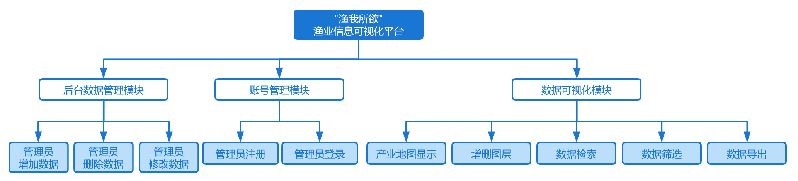
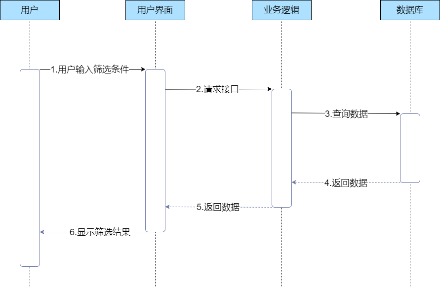
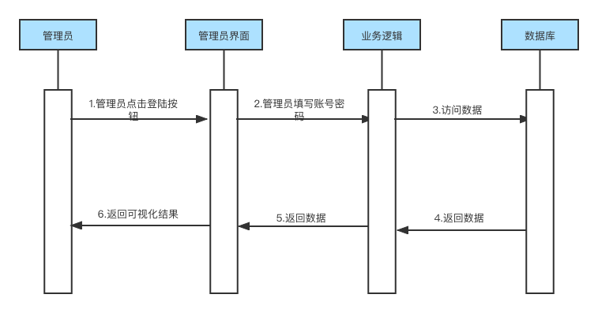

<h2>版本变更历史</h2>

| 版本号 | 作者                                               | 修订日期   | 审核者 | 审核日期   | 修订原因  |
| ------ | -------------------------------------------------- | ---------- | ------ | ---------- | --------- |
| 1.0    | 裴宇航，沈韵沨，沈轩喆， 应凌凯，吴樊，高世山 | 2022.11.25 | 裴宇航 | 2022.11.26 | 原始文档  |
| 2.0    | 裴宇航，沈韵沨，沈轩喆， 应凌凯，吴樊，高世山 | 2022.12.4  | 裴宇航 | 12.4       | 修改IPO图 |

<b>目录</b>

[TOC]

## 1 引言

### 1.1 编写目的

​	    该软件概要设计说明书以软件需求规格说明书和系统设计与实现计划为基础，说明系统的总体架构，各个功能的实现方式及数据库设计，明确各个模块的外部接口、内部接口和用户接口，为软件系统的开发提供指导，为软件系统的维护提供参照。

​		预期读者：

- 项目经理
- 系统分析人员
- 系统设计人员
- 系统开发人员
- 系统测试人员
- 系统质量分析员
- 系统维护人员

### 1.2 背景

​		信息可视化平台以其对数据信息的清晰呈现与直观对比，可以大幅降低信息分析成本、提升决策效率，以现代数字技术提供精确的度量分析服务，从而优化生产运营的各个环节，促进生产要素优化配置与传统生产方式变革。然而，作为我国第一产业的重要组成部分的渔业在信息可视化平台上仍存在明显缺位。由于该产业具有明显的区域性和季节性特征，旧式信息检索平台的低时效性、低直观性显然已无法满足该产业的发展需求。而Web应用的灵活性与多样的数据可视化功能显然能更及时直观的对有关信息进行呈现，契合行业发展需要。

​		网站系统名称：渔业产业地图信息可视化平台

​		项目提出方：软件工程管理课程老师邵健

​		项目开发者：软件工程管理课程第6小组

​		系统用户：广大渔业信息获取用户，主要面向渔业从业者

### 1.3 技术术语

1. **Mysql：**一个小型关系型数据库管理系统。

2. **Spring：**一个开源的轻量级Java SE（Java 标准版本）/Java EE（Java 企业版本）开发应用框架，其目的是用于简化企业级应用程序开发。

3. **Vue：**Vue主要用于构建前端UI。

4. **MD5：**MD5即Message\-Digest\-Algorithm5（信息摘要算法5），为计算机安全领域广泛使用的一种散列函数，用以提供消息的完整性保护，是一种不可逆加密算法。

5. **sha1：**sha1即Secure Hash Algorithm（安全哈希算法），主要适用于数字签名标准（Digital Signature Standard DSS）里面定义的数字签名算法（Digital SignatureAlgorithm DSA），是一种不可逆加密算法。

### 1.4 系统设计术语

1. **认证：**防范信息的损坏和泄露。
2. **权限：**指用户职能的范围，即各种用户所登录界面、所接触数据、所进行操作等的范围。
3. **用例：**用户场景通常称为用例，它提供了系统将如何被使用的描述。
4. **IPO图：**是输入/处理/输出图的简称，描述输入数据、对数据的处理和输出数据之间的关系。
5. **数据流图：**是SA方法中用于表示系统逻辑模型的一种工具，它以图形的方式描述数据在系统中流动和处理的过程，它是一种功能模型。
6. **CRC卡：**CRC模型实际上是表示类的标准索引卡片的集合。这些卡片被分为三部分，顶部写类名，下面左侧部分列出类的职责，右侧部分列出类的协作关系。
7. **数据词典：**是对所有与系统相关的 数据元素的一个有组织的列表、以及精确严格的定义，使得用户和系统分析员对于输入、输出、存储成分和中间计算有共同的理解。
8. **系统集成：**将不同的系统，根据应用需要，有机地组合成一个一体化的、功能更加强大的新型系统的过程和方法。

### 1.5 参考文献

[1] 《软件工程——实践者的研究方法》, Roger S.Pressman, 机械工业出版社

[2] 《软件需求（第三版）》, Karl Wiegers，Joy Beatty, 清华大学出版社

[3] 《软件工程开发国家标准》

[4] “在线教学辅助系统” G04-1-项目章程

[5] “在线教学辅助系统” G04-2-项目计划

[6] “在线教学辅助系统” G04-3-软件需求规格说明书

[7] “在线教学辅助系统” G04-4-软件设计说明书 

## 2 总体设计

### 2.1 用户需求规定

​				本需求优先级分析根据模块风险-价值四象限矩阵进行评级，即按照以下表格所示的四象限对需求进行优先级分类。

表 2-1 风险-价值四象限矩阵

|                             | 高价值                    | 低价值                    |
| --------------------------- | ------------------------- | ------------------------- |
| 
**高风险**
 | 
首先处理
 | 
避免
     |
| 
**低风险**
 | 
其次处理
 | 
最后处理
 |

​		考虑到实际情况的限制，以下估算仅作为策略性指导，随着项目的进行可能会调整。

表 2-2 需求优先级分析表

| 用例编号 | 用例名称             | 风险 | 价值 | 优先级 |
| -------- | -------------------- | ---- | ---- | ------ |
| UC-TC-01 | 用户概览产业地图信息 | 中   | 高   | 高     |
| UC-TC-02 | 用户编辑图层         | 中   | 中   | 中     |
| UC-TC-03 | 用户检索数据         | 高   | 高   | 中     |
| UC-TC-04 | 用户筛选数据         | 高   | 中   | 低     |
| UC-TC-05 | 用户导出数据         | 中   | 中   | 中     |
| UC-TC-06 | 管理员注册           | 中   | 低   | 低     |
| UC-TC-07 | 管理员登录           | 高   | 低   | 低     |
| UC-TC-08 | 管理员增删改数据     | 高   | 高   | 高     |

​	  

### 2.2 其他需求规定

#### 2.2.1 性能需求

​		服务器性能要求能满足网友日常的访问需求，保持并发承受能力，在界面简洁美观的基础上，使网络延时短。

#### 2.2.2 输入输出需求

​		客户端通过网页形式向用户展现一个简洁友好的操作界面，用户可以点击超链接跳转界面，点击按钮提交表单。

服务器后台处理数据后显示在网页界面上。

#### 2.2.3 数据管理需求

##### 安全

​		数据库对参与数据库操作的数据都会预处理后再加入查询语句，避免通过网页 SQL 注入的方式获 取数据库信息或破坏数据库。数据库中密码通过不可逆加密加密存储，限制过短的密码，减低密泄露 的风险。

##### 性能

​		对于需要频繁访问数据库的操作，需要建立持久的数据库连接。为减轻数据库负荷，在操作完成后断开连接。

#### 2.2.4 故障处理需求

​		软件开发团队提供系统维护支持，有完备的内部文档和外部文档。

​		系统报错信息可读性高。

### 2.3 运行环境

​		本网站主要服务于众多使用者，需要保证至少 100名使用者同时取得服务的需求，包括数据存储能力和网络吞吐能力，保证账户一定的安全性。

#### 2.3.1 软件运行环境

表 2-3 软件运行环境

| 项目             | 名称                                      | 版本   |
| ---------------- | ----------------------------------------- | ------ |
| 操作系统         | Windows7 及以上，MacOS                    |        |
| 网站服务器       | Nginx                                     | 1.15.8 |
| 数据库服务器     | Linux socket                              |        |
| 数据库服务器类型 | MySQL MongoDb Elasticsearch               | 8.0    |
| 浏览器           | Chrome，Safari，Edge，Firefox等主流浏览器 |        |

#### 2.3.2 硬件运行环境

表 2-4 硬件运行环境

| 项目                             | 名称                          |
| -------------------------------- | ----------------------------- |
| 操作系统                         | CPU:CORE i5 及以上            |
| 内存： 2G 及以上                 |                               |
| 硬盘：500G 及以上                |                               |
| 应用服务器                       | 内存： 512M 及以上            |
| 数据库服务器邮件服务器文件服务器 | 硬盘：50G 及以上              |
| 通讯设备                         | 网线 ：具有良好的数据传输能力 |

 

### 2.4 基本设计概念和处理流程

#### 2.4.1 服务器

​		使用阿里云服务器，Python 编写后端代码，数据库采用 Mysql 数据库。当用户通过浏览器使用网站系统时，浏览器接收用户的请求，并传送到服务器，执行相应的程序，通过搜索引擎 ES 查询相关内容，并且从数据库接口函数向数据库发送 SQL 查询语句，数据库接收 SQL 查询语句后执行，返回查询结果，处理查询结果后返回给前端，并显示在网站页面上。

#### 2.4.2 客户端

​		浏览器采用常用的 IE、Chrome、FireFox 等。客户端在不频繁的操作页面时完成操作后断开与数据库的连接以减轻服务器负荷；在操作频繁时保持连接以增加访问速度。

​		客户端动态页面：嵌入 Vue，动态网页以数据库技术为基础，能降低网站维护的工作量。

​		Vue：页面的各种文本框与按键操作能够完成，同时能实现无刷新页面的一些动画效果，包括下拉菜单等。

 
图 2-1 服务器与客户端处理流程图

### 2.5 结构

#### 2.5.1 系统模块架构

  
图 2-2 系统模块架构图

#### 2.5.2 系统模块设计

  
图 2-3 系统模块设计图

#### 2.5.3 数据上下文

   
图 2-4 数据上下文图

#### 2.5.4 总体 E-R 图

  
图 2-5 总E-R图

#### 2.5.5 关键IPO图

##### 查看产业地图可视化地图图表

##### 查看层叠的产业地图

##### 查看产业地图的原始数据表格

##### 导出产业地图

##### 管理员注册

##### 管理员登录

##### 管理员修改产业地图数据

### 2.6 用例

​		注：此处规定的用例可以用于在测试阶段作为test case。

#### 2.6.1 用户概览产业地图信息

##### 用例描述

表 2-5 用户概览产业地图信息用例描述

| 用例编号：UC-TC-01   | 用例名称：用户概览产业地图信息                               |
| -------------------- | ------------------------------------------------------------ |
| 创建人：沈韵沨       | 最后修改人：沈韵沨                                           |
| 创建日期：2022/10/21 | 最后修改日期：2022/10/23                                     |
| 角色：用户           | 主要参与者：用户                                             |
| 需求来源             | 用户调研                                                     |
| 描述                 | 用户点击显示按钮后，系统以地图形式可视化显示数据             |
| 前置条件             | 1.系统正常运行 2.用户可以正常打开相关界面               |
| 触发器               | 用户点击显示按钮                                             |
| 后置条件             | 前后端交互正常                                               |
| 输入信息             | 用户选定的源数据种类                                         |
| 主干过程             | 1.用户进入数据检索页 2.用户选定待显示的源数据 3.用户点击显示按钮 |
| 分支过程             | 无                                                           |
| 异常                 | 1.用户无法正常进入网站主页 2.用户选取源数据后系统无响应 3.用户取消数据图层显示后系统无响应 4.用户点击显示按钮后系统无响应 处理：用户进行刷新，若仍存在异常则联系管理员进行解决 |
| 假设                 | 无异常发生                                                   |
| 输入                 | 数据源信息：type                                             |
| 输出                 | 数据可视化结果界面                                           |
| 包括用例             | 无                                                           |
| 优先级               | 高                                                           |
| 使用频率             | 高                                                           |
| 备注与问题           | 无                                                           |

##### 时序图

图 2-6 用户概览产业地图信息时序图

##### 活动图

图 2-7 用户概览产业地图信息活动图

#### 2.6.2 用户编辑图层

##### 用例描述

表 2-6 用户编辑图层用例描述

| 用例编号：UC-TC-02   | 用例名称：用户编辑图层                                       |
| -------------------- | ------------------------------------------------------------ |
| 创建人：沈韵沨       | 最后修改人：沈韵沨                                           |
| 创建日期：2022/10/21 | 最后修改日期：2022/10/23                                     |
| 角色：用户           | 主要参与者：用户                                             |
| 需求来源             | 用户调研                                                     |
| 描述                 | 用户对待显示的数据源进行增加或删除操作                       |
| 前置条件             | 1.系统正常运行  2.用户可以正常打开相关界面              |
| 触发器               | 用户点击添加/删除按钮                                        |
| 后置条件             | 前后端交互正常                                               |
| 输入信息             | 收到影响的数据源种类、操作类型（添加或删除）                 |
| 主干过程             | 1.用户进入数据可视化结果页面 2.用户点击删除按钮         |
| 分支过程             | 1.用户进入数据可视化结果界面 2.用户点击添加按钮 3.用户选择添加的数据源 |
| 异常                 | 1.用户点击删除/添加页面后系统无响应 2.用户选取新增数据源后系统无响应 处理：用户进行刷新，若仍存在异常则联系管理员进行解决 |
| 假设                 | 无异常发生                                                   |
| 输入                 | 受影响的数据源信息：type，操作种类：operation                |
| 输出                 | 待显示的数据源列表                                           |
| 包括用例             | 无                                                           |
| 优先级               | 低                                                           |
| 使用频率             | 中                                                           |
| 备注与问题           | 无                                                           |

##### 时序图

图 2-8 用户编辑图层时序图

##### 活动图

图 2-9 用户编辑图层活动图

#### 2.6.3 用户检索数据

##### 用例描述

表 2-7 用户检索数据用例描述

| 用例编号：UC-TC-03   | 用例名称：用户检索数据                                       |
| -------------------- | ------------------------------------------------------------ |
| 创建人：沈韵沨       | 最后修改人：沈韵沨                                           |
| 创建日期：2022/10/21 | 最后修改日期：2022/10/23                                     |
| 角色：用户           | 主要参与者：用户                                             |
| 需求来源             | 用户调研                                                     |
| 描述                 | 用户通过分类目录索引选取待显示的数据源                       |
| 前置条件             | 1.系统正常运行  2.用户可以正常打开相关界面              |
| 触发器               | 用户点击检索按钮                                             |
| 后置条件             | 前后端交互正常                                               |
| 输入信息             | 无                                                           |
| 主干过程             | 1.用户进入网站主页 2.用户点击检索按钮                   |
| 分支过程             | 无                                                           |
| 异常                 | 1.用户无法正常进入网站主页 2.用户点击检索按钮后系统无响应 处理：用户进行刷新，若仍存在异常则联系管理员进行解决 |
| 假设                 | 无异常发生                                                   |
| 输入                 | 无                                                           |
| 输出                 | 所有数据源的分类目录索引界面                                 |
| 包括用例             | 无                                                           |
| 优先级               | 高                                                           |
| 使用频率             | 高                                                           |
| 备注与问题           | 无                                                           |

##### 时序图

图 2-10 用检索数据时序图

##### 活动图

图 2-11 用户检索数据活动图
 

#### 2.6.4 用户筛选数据

##### 用例描述

表 2-8 用户筛选数据用例描述

| 用例编号     | UC-TC-04                                                     |
| ------------ | ------------------------------------------------------------ |
| 用例名称     | 用户筛选数据                                                 |
| 创建人       | 沈轩喆                                                       |
| 最后修改人   | 沈轩喆                                                       |
| 创建日期     | 2022/10/26                                                   |
| 最后修改日期 | 2022/10/26                                                   |
| 角色         | 用户                                                         |
| 需求来源     | 用户调研                                                     |
| 主要参与者   | 用户                                                         |
| 描述         | 用户点击筛选按钮，设置好筛选条件，系统显示筛选的结果         |
| 前置条件     | 1.  系统正常运行 2. 用户可正常打开相关界面              |
| 触发器       | 用户点击筛选按钮                                             |
| 后置条件     | 前后端交互正常                                               |
| 输入信息     | 用户设置的筛选条件                                           |
| 主干过程     | 1.  用户进入数据界面 2. 用户点击筛选按钮 3. 用户输入筛选条件 |
| 分支过程     | 无                                                           |
| 异常         | 1.  用户无法正常获取数据 2. 用户点击筛选按钮后无响应 3. 用户输入的筛选条件存在语法错误 处理：用户刷新页面，重新输入筛选条件，若仍存在异常则联系管理员处理 |
| 假设         | 无异常发生                                                   |
| 输入         | 筛选条件：condition                                          |
| 输出         | 筛选结果                                                     |
| 包括用例     | 无                                                           |
| 优先级       | 中                                                           |
| 使用频率     | 高                                                           |
| 备注与问题   | 无                                                           |

##### 时序图

图 2-12 用户筛选数据时序图

##### 活动图

图 2-13 用户筛选数据活动图

#### 2.6.5 用户导出数据

##### 用例描述

表 2-9 用户导出数据用例描述

| 用例编号     | UC-TC-05                                                     |
| ------------ | ------------------------------------------------------------ |
| 用例名称     | 用户导出数据                                                 |
| 创建人       | 沈轩喆                                                       |
| 最后修改人   | 沈轩喆                                                       |
| 创建日期     | 2022/10/26                                                   |
| 最后修改日期 | 2022/10/26                                                   |
| 角色         | 用户                                                         |
| 需求来源     | 用户调研                                                     |
| 主要参与者   | 用户                                                         |
| 描述         | 用户点击导出按钮，系统生成选择的类型的文件                   |
| 前置条件     | 1.  系统正常运行 2. 用户可正常打开相关界面              |
| 触发器       | 用户点击导出按钮，选择导出的文件类型                         |
| 后置条件     | 前后端交互正常                                               |
| 输入信息     | 用户选择的文件类型                                           |
| 主干过程     | 1.  用户进入数据界面 2. 用户点击导出按钮 3. 用户选择导出的文件类型 |
| 分支过程     | 无                                                           |
| 异常         | 1.  用户无法正常获取数据 2. 用户点击导出按钮后无响应 3. 用户选择文件类型时无响应 处理：用户刷新页面，若仍存在异常则联系管理员处理 |
| 假设         | 无异常发生                                                   |
| 输入         | 文件类型：outputType                                         |
| 输出         | 所选类型的文件                                               |
| 包括用例     | 无                                                           |
| 优先级       | 中                                                           |
| 使用频率     | 高                                                           |
| 备注与问题   | 无                                                           |

##### 时序图

图 2-13 用户导出数据时序图

##### 活动图

图 2-14 用户导出数据活动图

#### 2.6.6 管理员注册

##### 用例描述

表 2-10 管理员注册用例描述

| 用例编号：UC-TC-06   | 用例名称：管理员注册                                         |
| -------------------- | ------------------------------------------------------------ |
| 创建人：应凌凯       | 最后修改人：应凌凯                                           |
| 创建日期：2022/10/22 | 最后修改日期：2022/10/27                                     |
| 角色：管理员         | 主要参与者：管理员                                           |
| 需求来源             | 管理员调研                                                   |
| 描述                 | 管理员点击注册按钮后，可以进行相关信息的注册                 |
| 前置条件             | 1.系统正常运行 2.管理员可以正常打开相关界面             |
| 触发器               | 管理员点击注册按钮                                           |
| 后置条件             | 前后端交互正常                                               |
| 输入信息             | 管理员自身基本信息以及设置的账号密码                         |
| 主干过程             | 1.管理员进入注册界面 2.管理员填写相关信息 3.管理员点击注册按钮 |
| 分支过程             | 无                                                           |
| 异常                 | 1.管理员无法正常进入注册页面 2.管理员填写完信息后系统无响应 3.管理员输入信息不合规定 4.管理员点击注册按钮后系统无响应 |
| 假设                 | 无异常发生                                                   |
| 输入                 | 数据源信息：type                                             |
| 输出                 | 数据可视化界面                                               |
| 包括用例             | 无                                                           |
| 优先级               | 高                                                           |
| 使用频率             | 高                                                           |
| 备注与问题           | 无                                                           |

##### 时序图

图 2-15 管理员注册时序图

##### 活动图

图 2-16 管理员注册活动图

#### 2.6.7 管理员登陆

##### 用例描述

表 2-11 管理员登陆用例描述

| 用例编号：UC-TC-07   | 用例名称：管理员登陆                                         |
| -------------------- | ------------------------------------------------------------ |
| 创建人：应凌凯       | 最后修改人：应凌凯                                           |
| 创建日期：2022/10/22 | 最后修改日期：2022/10/27                                     |
| 角色：管理员         | 主要参与者：管理员                                           |
| 需求来源             | 管理员调研                                                   |
| 描述                 | 管理员点击登陆按钮后，可以进入管理页面                       |
| 前置条件             | 1.系统正常运行 2.管理员可以正常打开相关界面             |
| 触发器               | 管理员点击登陆按钮                                           |
| 后置条件             | 前后端交互正常                                               |
| 输入信息             | 管理员自己的账号密码                                         |
| 主干过程             | 1.管理员进入登陆界面 2.管理员填写自己的账号密码 3.管理员点击登陆按钮 |
| 分支过程             | 无                                                           |
| 异常                 | 1.管理员无法正常进入登陆页面 2.管理员填写完账号密码后系统无响应 3.管理员输入账号密码错误 4.管理员点击登陆按钮后系统无响应 |
| 假设                 | 无异常发生                                                   |
| 输入                 | 数据源信息：type                                             |
| 输出                 | 数据可视化界面                                               |
| 包括用例             | 无                                                           |
| 优先级               | 高                                                           |
| 使用频率             | 高                                                           |
| 备注与问题           | 无                                                           |

##### 时序图

图 2-17 管理员登陆时序图

##### 活动图

图 2-18 管理员登陆活动图

#### 2.6.8 管理员增删改数据

##### 用例描述

表 2-12 管理员增删改数据用例描述

| 用例编号：UC-TC-08   | 用例名称：管理员增删改数据                                   |
| -------------------- | ------------------------------------------------------------ |
| 创建人：应凌凯       | 最后修改人：应凌凯                                           |
| 创建日期：2022/10/22 | 最后修改日期：2022/10/27                                     |
| 角色：管理员         | 主要参与者：管理员                                           |
| 需求来源             | 管理员调研                                                   |
| 描述                 | 管理员对待显示的数据源进行增加或删除操作                     |
| 前置条件             | 1.系统正常运行  2.管理员可以正常打开相关界面            |
| 触发器               | 管理员点击添加/删除按钮                                      |
| 后置条件             | 前后端交互正常                                               |
| 输入信息             | 收到影响的数据源种类、操作类型（添加或删除）                 |
| 主干过程             | 1.管理员进入数据可视化结果页面 2.管理员点击删除按钮     |
| 分支过程             | 1.管理员进入数据可视化结果界面 2.管理员点击添加按钮 3.管理员选择添加的数据源 |
| 异常                 | 1.管理员点击删除/添加数据后系统无响应                        |
| 假设                 | 无异常发生                                                   |
| 输入                 | 受影响的数据源信息：type，操作种类：operation                |
| 输出                 | 待显示的数据源列表                                           |
| 包括用例             | 无                                                           |
| 优先级               | 低                                                           |
| 使用频率             | 中                                                           |
| 备注与问题           | 无                                                           |

##### 时序图

图 2-19 管理员增删改数据时序图

##### 活动图

图 2-20 管理员增删改数据活动图

### 2.7 数据流图

**用户数据流图：**

 

 
图 2-21 用户数据流图

**第 0 层查询：** 

 
图 2-22 第0层查询

**第 0 层查询地图：**

 
图 2-23 第0层查询地图

**第 0 层新建图层：**

 
图 2-24 第0层新建图层

### 2.8 QFD

表 2-13 QFD

| 用例编号 | 用例名称             | 价值 | 未完成带来的损失 | 成本 | 风险 | 优先级 |
| -------- | -------------------- | ---- | ---------------- | ---- | ---- | ------ |
| UC-TC-01 | 用户概览产业地图信息 | 10   | 10               | 8    | 5    | 高     |
| UC-TC-02 | 用户编辑图层         | 7    | 5                | 7    | 5    | 中     |
| UC-TC-03 | 用户检索数据         | 8    | 8                | 7    | 8    | 中     |
| UC-TC-04 | 用户筛选数据         | 7    | 7                | 7    | 8    | 低     |
| UC-TC-05 | 用户导出数据         | 6    | 5                | 5    | 5    | 中     |
| UC-TC-06 | 管理员注册           | 5    | 5                | 3    | 5    | 低     |
| UC-TC-07 | 管理员登陆           | 5    | 5                | 3    | 9    | 低     |
| UC-TC-08 | 管理员增删改数据     | 10   | 10               | 5    | 10   | 高     |

### 2.9 数据字典

#### 2.9.1 用户搜索数据

表 2-14 用户搜索的数据字典

| 数据元素 |      描述      | 数据类型  | 数据长度 |     数据取值     |
| :------: | :------------: | :-------: | :------: | :--------------: |
| 搜索内容 |   搜索关键词   |  字符串   |  0-50位  | 0~9, a~z, A~Z, … |
| 词条内容 | 返回的数据内容 | entry对象 |    1     |     json数据     |

#### 2.9.2 搜索过程中的词条

表 2-15 搜索过程的数据字典

| 数据元素 |     描述     | 数据类型 | 数据长度 |     数据取值      |
| :------: | :----------: | :------: | :------: | :---------------: |
|    IP    | 用户的IP地址 |  字符串  |  0-50位  |      0~9, .       |
|   name   | 访问的数据名 |  字符串  |  1-50位  | 0~9,  a~z, A~Z, … |
|   内容   |   数据内容   |  字符串  |  0-50位  | 0~9, a~z, A~Z, …  |

#### 2.9.3 数据详细信息

表 2-16 数据详细信息的数据字典

| 数据元素 |   描述   | 数据类型 | 数据长度 |     数据取值     |
| :------: | :------: | :------: | :------: | :--------------: |
|   名称   |  数据名  |  字符串  |  0-50位  | 0~9, a~z, A~Z, … |
|    id    |  数据id  |   整数   |  1-10位  |       0-9        |
|   内容   | 数据内容 |  字符串  |  0-50位  | 0~9, a~z, A~Z, … |

### 2.9 人工处理过程

​		在本系统的运行过程中，可能会出现一些系统无法自动解决的问题，需要人工处理介入来解决， 包括数据库表格的新增、相关图片的爬取等。

​		密码重置过程的人工处理：当管理员忘记密码且未填写邮箱或忘记所填写的邮箱时，只能通过进入数据库进行处理。

### 2.10 尚未解决的问题

​		服务器部署：包括数据库服务器、web服务器。

​		系统负载能力：避免服务器易瘫痪。

## 3 接口设计

### 3.1 用户接口

​		本系统作为在线数据可视化系统，用户的所有行为均通过浏览器在网页界面进行实现。用户主要以鼠标点击事件与键盘输入形式完成于系统的交互，交互过程中涉及的可视化组件主要为：按钮、输入框、下拉选择框、模态对话框等。

​		主要接口分布如下表所示：

| 一级链接             | 二级链接      | 三级链接 | 四级链接       |
| -------------------- | ------------- | -------- | -------------- |
| **管理员注册界面**   | 注册成功/失败 |          |                |
| **管理员登录界面**   | 登录成功/失败 |          |                |
| **后台数据管理界面** | 数据源列表    | 详细信息 | 增加/删除/修改 |
| **数据源检索界面**   | 检索结果      | 添加图层 | 添加成功       |
| **数据可视化界面**   | 可视化结果    |          |                |
|                      | 删除图层      | 删除成功 |                |
|                      | 结果导出      | 导出成功 |                |
|                      | 数据筛选      | 筛选结果 |                |

#### 3.1.1 管理员接口

1. 注册接口
2. 登录、登出接口
3. 添加、删除数据接口
4. 修改数据接口

#### 3.1.2 普通用户接口

1. 数据源检索接口
2. 数据筛选接口
3. 添加、删除可视化图层接口
4. 目标数据可视化接口
5. 结果导出接口

### 3.2 外部接口

​		本系统所涉及的部分数据存储在服务器及数据库中。其中，搜索及可视化功能所需的数据以文本形式存储，图片及其他不宜以数据库表项形式存储的资源以文件形式进行存储。在网页前端获取用户需求及输入后，由网页后端完成与服务器及数据库的交互。利用 Vue、Flask 等框架完成与 MySQL 之间的外部接口设计。

​		本系统所需的初始数据通过脚本进行导入。

### 3.3 内部接口

​		本系统按照用户类型划分为普通用户与管理员两个模块，分别实现数据的可视化分析与后台数据管理功能。模块间不共享界面，耦合度较低。但两个模块共享数据库表项，需要在独立开发前完成对数据库表项格式的统一。

## 4 运行设计

​		本章描述对系统施加不同的外界运行控制时所引起的各种不同的运行模块组合。

### 4.1 运行模块的组合

#### 4.1.1 基本要求

​		本系统按照功能划分为三大模块，每个模块又细分为多个子模块。每个模块不共享界面，相对独立。各个模块下的子模块共享界面。各个模块之间不会共享界面，但共享数据库数据和搜索引擎，后台程序只共享数据库连接和搜索引擎。

​		每个模块按照流程划分客户端界面、客户端脚本和后台服务器程序。各模块之间通过客户端路由，实现用户接口层面的运行模块组合。

#### 4.1.2 详细运行模块组合设计

##### 数据可视化模块组合

1. 用户检索数据、产业地图显示组合。
2. 产业地图显示、用户增加图层、用户筛选数据、用户导出数据组合。

##### 后台数据管理模块组合

1. 管理员登录、管理员添加数据组合。
2. 管理员登录、管理员修改数据组合。
3. 管理员登录、管理员删除数据组合。

### 4.2 运行控制

#### 4.2.1 用户接口运行控制要求

​		界面是用户直接与系统交互的部分。在设计界面时，应做到如下几点要求：

1. 界面能给用户提供便捷的操作，引导用户进行无障碍操作。
2. 界面能够以生动有效的方式达到数据可视化要求。
3. 界面应简洁而不简陋，在便捷操作的基础上增加美观度；界面能够体现“渔业”的相关元素。

#### 4.2.2 运行控制的条件与限制

##### 运行控制的条件

​		本项目的开发要求小组成员足够的参与度，能及时保质保量完成任务。

##### 运行控制的限制

​		项目开发过程中可能会有技术上的难点和设备方面的欠缺，需要开发小组合理利用现有设备和资源，积极查找资料解决问题。

​		在完成项目开发的基础上，还需要保证项目的可用性、安全性、可维护性等。

#### 4.2.3 前台与后台的关系

​		前台主要展示搜索词条信息、词条内容等显示信息，后台主要负责业务流程，控制前台显示信息，负责与搜索引擎和数据库交互。前后台的整体关系应当遵循先前报告对于技术栈的相关规定。

#### 4.2.4 详细运行控制设计

##### 数据可视化运行控制

1. 用户检索到数据后，才能以产业地图的形式进行可视化。
2. 只有当产业地图的相关格式支持层叠时，用户才能实现相关图层操作。

##### 后台数据管理运行控制

1. 管理员只有通过账号和密码完成登录，才能对后台数据进行增加、修改和删除。
2. 管理员只有在系统进入维护状态时才能进行后台数据的操作。

### 4.3 运行时间

#### 4.3.1 运行时间总体分析

​		用户在做搜索时候前端不不断的向ES搜索引擎请求数据，频繁与数据库交互以获取信息，会占用较多的数据库资源。

#### 4.3.2 运行时间详细分析

##### 数据可视化模块运行时间

**耗时较少的功能模块有：**

​		增删图层、数据筛选、数据导出。这三个功能是在用户已经将相关数据读入客户端后进行的操作，不需要再次请求数据库。

**耗时较多的功能模块有：**

​		用户检索数据、产业地图显示。这两个功能需要对数据库数据进行读取，因此耗时较大。为了节约后续操作的耗时，这两个操作每次会读入较多的数据。

##### 后台数据管理模块运行时间

**耗时较多的功能模块有：**

​		管理员添加数据、管理员修改数据、管理员删除数据。数据管理模块设计的操作都需要对数据库进行写操作，需要消耗较多时间。

## 5 系统数据结构设计

### 5.1 逻辑结构设计要点

**MySQL数据库设计**

Table: `admin`

Table: `user`

Table: `coverage`

Table: `data_table`

Table:  `data_column`

Table:  `tag`

### 5.2 物理结构设计要点

数据表项存储在数据库中，通过SQL语句访问数据库获取。

## 6 系统出错设计

### 6.1 出错信息

表 6-1 出错信息表

| 输出信息形式                            | 含义                                                         | 处理方法                     |
| --------------------------------------- | ------------------------------------------------------------ | ---------------------------- |
| 数据库连接失败                          | 由于并发操作的用户数量很大，导致数据库访问读写率降低；或者数据库配不对，导致数据库连接失败 | 修改服务器配置，尝试重连     |
| 管理员cookie的登陆token与数据库信息不符 | 管理员cookie被劫持，账号被盗取                               | 强制清楚cookie，要求重新登录 |
| 数据无法加载                            | 数据库因硬盘损坏等原因丢失数据                               | 尝试修复或启用备份           |

### 6.2 补救措施

#### 6.2.1 系统备份

​		定期备份系统数据，当系统数据因不可抗拒力丢失时，可以启用备份数据。

#### 6.2.2 分布式部署

​		将系统部署到不同计算机上，减小某台计算机硬件损坏造成的数据丢失的影响。 

## 7 系统维护设计

### 7.1 概述

1. 连接数据库时，需要在创建数据库连接、销毁数据库连接时使用`try catch`语句捕获异常，对不同的错误信息尽量区分输出。
2. 管理员有权查看网站的整体状况，以防系统出现不可预计的错误以及显示不合法信息。
3. 管理员与系统维护人员每次管理维护后需要留下完备可读的系统维护日志便于管理员和其他维护人员查看。

### 7.2 监测点设计

1. **筛选功能测试流程：**

   a. 查看数据

   b. 设置筛选条件

   c. 查看筛选结果

2. **数据可视化功能测试流程：**

   a. 查看数据

   b. 选择数据进行可视化

3. **搜索功能测试流程：**

   a. 进入首页

   b. 输入搜索关键字进行搜索

   c. 查看搜索结果

4. **管理员编辑数据功能测试流程：**

   a. 进入登陆页面，管理员登陆

   b. 查看数据、编辑数据、删除数据

### 7.3 系统维护设计

1. **数据库维护：**定期备份数据库文件。

2. **硬件资源维护：**定期清理硬盘垃圾，整理磁盘碎片，根据需要优化服务器性能。
3. **系统功能升级：**根据用户需求反馈，对系统功能进行更新。
