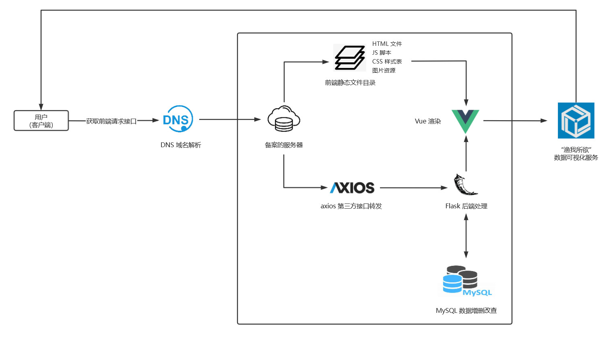

> 下划线的部分需要对照 `4` 中的内容进行填写。

## 2 测试概要

​	“渔我所欲”渔业信息可视化平台测试自2022年12月12日开始至2022年12月15日结束共对_个功能点进行了持续测试，执行了\_个测试用例，平均每功能点执行测试用例\_个。测试共发现 bug _ 个，其中较为严重的 bug 为 \_ 个，无效 bug 为 \_ 个，平均每测试点检出 \_ 个有效 bug。

​	“渔我所欲”渔业信息可视化平台共发布了2个测试版本，其中 Ver. 1 为针对项目基线标识的计划内迭代开发版本，Ver. 2 为回归测试版本：对计划内迭代开发的 Ver.1 版本的测试与报告撰写增加 1 个人·日，准时完成测试。Ver. 2 版本推迟一天进行发布，测试增加 3 个人·日，准时完成测试。

​	本次测试采用 `Bugzilla` 作为缺陷跟踪管理工具，各测试阶段均具备详细的 bug 分析表与阶段测试报告。

### 2.1 测试环境

| 硬件环境  | 硬件配置                        | 软件配置                                | 网络环境 |
| --------- | ------------------------------- | --------------------------------------- | -------- |
| CVM服务器 | 2G Memory 2核     50G ROM  | Ubuntu 20.04 Python  Node.js       | 1 Mbps   |
| Web客户端 | 16G Memory 4核    512G ROM | Windows 10 Edge / FireFox / Chrome | 校网带宽 |
| Android   | 4G Memory 8核    256G ROM  | Android 13 Chrome / Firefox        | 校网带宽 |
| IOS       | 4G Memory 4核   256G ROM   | IOS 13 Safari / Chrome             | 校网带宽 |

### 2.2 网络拓扑

