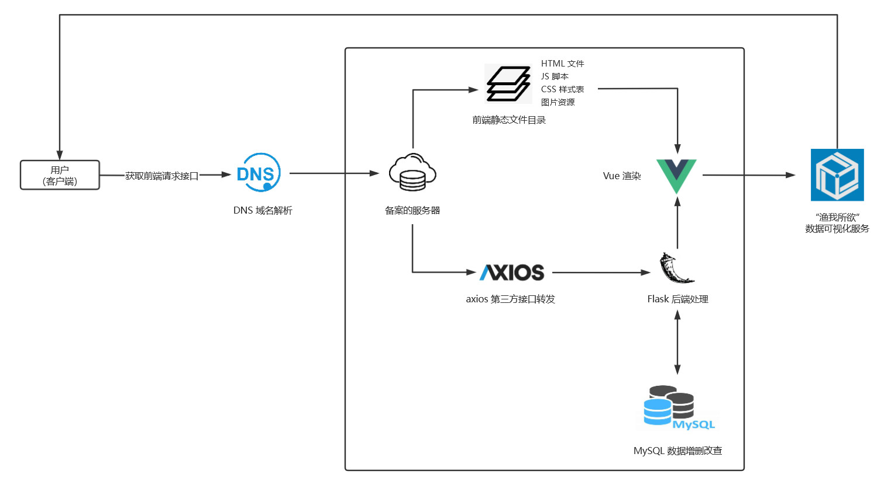
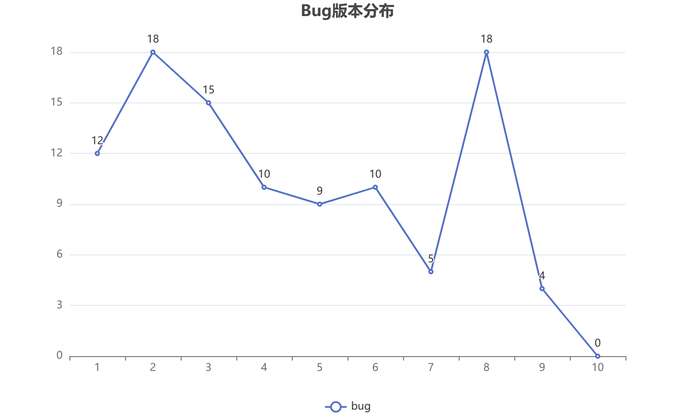
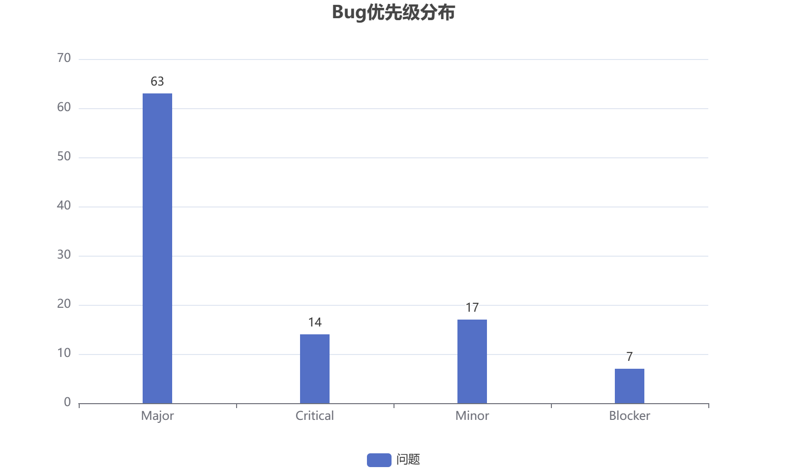
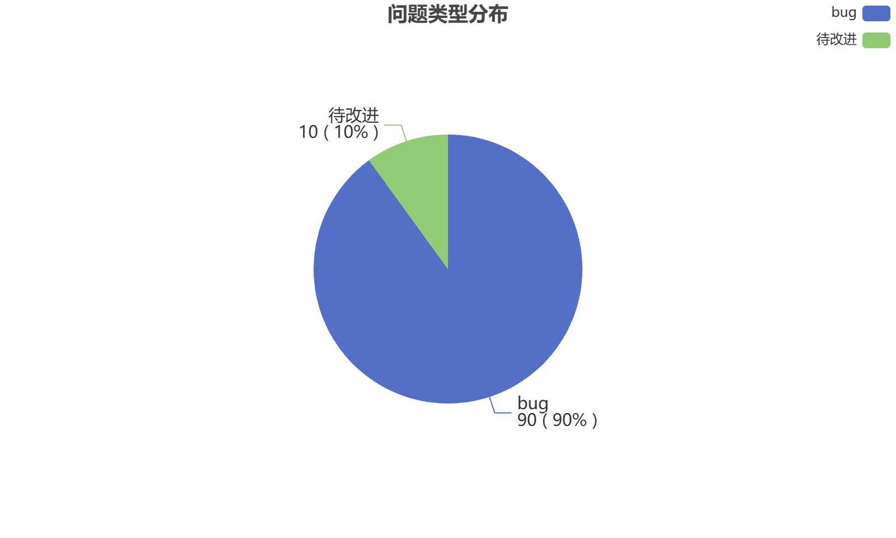
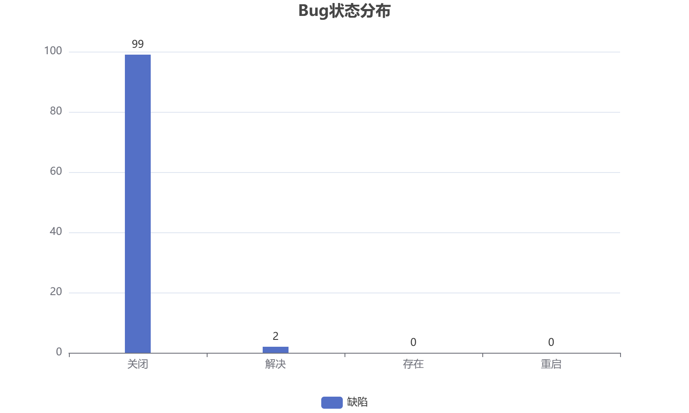

## 1 引言

### 1.1 编写目的

​		编写该测试总结报告主要有以下几个目的：

1. 通过对测试结果的分析，得到对软件质量的评价。
2. 分析测试的过程、产品、资源、信息，为以后制定测试计划提供参考。
3. 评估测试执行和测试计划是否符合。
4. 分析系统存在的缺陷，为修复和预防bug提供建议。

### 1.2 软件背景

​		该项目旨在建立一个渔业信息可视化平台，为渔业从业者提供可视化渔业信息。

​		互联网等网络技术的发展和应用，使抽象出来的数据、信息、知识在不同主体间流动、对接、融合，大幅提升了数据处理的时效性、自动化与智能化水平。然而，作为我国第一产业的重要组成部分的渔业在信息可视化平台上仍存在明显缺位。由于该产业具有明显的区域性和季节性特征，旧式信息检索平台的低时效性、低直观性显然已经无法满足该产业的发展需求。而web应用的灵活性与多样的数据可视化功能显然能更及时直观地对有关信息进行呈现，契合行业发展需要。

### 1.3 定义

##### 任务提出者

​	**严重bug**：出现以下缺陷，测试定义为严重bug：

- 系统无响应，处于死机状态，需要其他人工修复系统才可复原。
- 点击某个菜单后出现“The page cannot be display” 或者返回异常错误。
- 进行某个操作（增加、修改、删除）后，出现“The page cannot be display” 或者返回异常错误。
- 当对必填字段进行校验时，未输入必输字段，出现“The page cannot be display” 或者返回异常错误。
- 系统定义不能重复的字段输入重复数据后，出现“The page cannot be display” 或者返回异常错误基于公网IP的服务器与数据库。

### 1.4 参考资料

[1] 《软件工程——实践者的研究方法》, Roger S.Pressman, 机械工业出版社

[2] 《软件需求（第三版）》, Karl Wiegers，Joy Beatty, 清华大学出版社

[3] 《软件工程开发国家标准》

[4] “在线教学辅助系统” G04-1-项目章程

[5] “在线教学辅助系统” G04-2-项目计划

[6] “在线教学辅助系统” G04-3-软件需求规格说明书

[7] “在线教学辅助系统” G04-4-软件设计说明书

[8] “网络热词聚合搜索引擎” G04-6-测试报告 

### 1.5 测试方式

​		本次测试方式较简单，因为测试任务不是特别艰巨，测试条目不是很多，因此小组通过简单地直接项目逐一测试的方式；同时，小组的其余成员对测试结果经过验证通过。

## 2 测试概要

​		“渔我所欲”渔业信息可视化平台测试自2022年12月12日开始至2022年12月15日结束共对_个功能点进行了持续测试，执行了\_个测试用例，平均每功能点执行测试用例\_个。测试共发现 bug _ 个，其中较为严重的 bug 为 \_ 个，无效 bug 为 \_ 个，平均每测试点检出 \_ 个有效 bug。

​		“渔我所欲”渔业信息可视化平台共发布了2个测试版本，其中 Ver. 1 为针对项目基线标识的计划内迭代开发版本，Ver. 2 为回归测试版本：对计划内迭代开发的 Ver.1 版本的测试与报告撰写增加 1 个人·日，准时完成测试。Ver. 2 版本推迟一天进行发布，测试增加 3 个人·日，准时完成测试。

​		本次测试采用 `Bugzilla` 作为缺陷跟踪管理工具，各测试阶段均具备详细的 bug 分析表与阶段测试报告。

### 2.1 测试环境

| 硬件环境  | 硬件配置                        | 软件配置                                | 网络环境 |
| --------- | ------------------------------- | --------------------------------------- | -------- |
| CVM服务器 | 2G Memory 2核     50G ROM  | Ubuntu 20.04 Python  Node.js       | 1 Mbps   |
| Web客户端 | 16G Memory 4核    512G ROM | Windows 10 Edge / FireFox / Chrome | 校网带宽 |
| Android   | 4G Memory 8核    256G ROM  | Android 13 Chrome / Firefox        | 校网带宽 |
| IOS       | 4G Memory 4核   256G ROM   | IOS 13 Safari / Chrome             | 校网带宽 |

### 2.2 网络拓扑

图2-1 网络拓扑图

## 3 测试计划执行情况

### 3.1 测试项目的选择和验证

表3-1 测试项目内容与目的

| 测试项目名称         | 测试内容                                                     | 测试目的                                                     |
| -------------------- | ------------------------------------------------------------ | ------------------------------------------------------------ |
| 数据及数据库集成测试 | 依照需求文档中的数据描述对数据库的设计、表的实现以及数据的可操作性进行查看并判断验证 | 确保系统在数据上不存在缺漏                                   |
| 用户界面测试         | 查看并判断验证在实际的用户使用场景中，网站界面的显示正常，界面内各元素的布局和外观正常，同时系统所实现的功能都能正确地被用户所访问到 | 用户通过网站界面访问系统提供的各种功能，通过对用户界面进行测试以确保系统的可使用性 |
| 功能测试             | 按照需求文档中设计的 use case 对系统的功能以此进行查看并判断验证 | 完成《软件需求规格说明书》                                   |
| 性能测试             | 测量系统响应时间，业务处理速率以及其他和时间相关的指标，并且在低数据量以及高数据量两种情况下进行相关指标的测试 | 查看并判断验证系统在低数据量以及高数据量的环境中的系统响应情况，确保用户能有良好的使用体验 |
| 负载测试             | 测试在一定数量的并发访问下的网站状态以及测试在一定数量的用户同时在线操作下，系统的表现 | 确保系统能够支持足够多的用户同时使用，应用场景能满足甲方的预期要求 |
| 错误恢复测试         | 测试在网站服务器发生异常情况比如进程被中断，硬件故障等情况下的恢复功能 | 确保系统在发生意外后数据的可靠性                             |
| 安全测试             | 查看并判断验证系统在面对常见的攻击手段时的可靠性以及用户进行特殊情况下的稳定性 | 确保用户个人信息及用户使用数据的保密性，系统运作的稳定性     |

​		上述测试项目的选择是机遇上述项目均为构成一个网站的关键因素。维护网站稳定和正常运转的必要条件。因此上述因素的一一测试显得尤为重要，将通过对每一类元素可能出现的情况进行测试。具体测试方式方法和测试项目在下一章节展开。

### 3.2 测试机构和人员

##### 测试机构名称

​		数据库基础，主要为MongoDB与MySQL

​		编程语言培训

​		编程工具的培训

​		针对需求，进一步加强软件开发规范和软件开发过程质量，了解客户的真正需求，提高开发人员开发素质，使开发人员成为高质量的软件工程师。结合项目进行案例讨论，根据讨论过程进行评估。

### 3.3 测试结果

#### 用户界面测试

表3-4 用户界面测试结果表

| ID    | 描述                                                         | 步骤                                                         | 测试数据 | 预期结果                                                     | 实际结果 |
| ----- | ------------------------------------------------------------ | ------------------------------------------------------------ | -------- | ------------------------------------------------------------ | -------- |
| UI_1  | 查看并判断验证主界面在IE版本中是否正常显示                   | 1.在WIN7、WIN8、WIN10系统浏览器及更高版本中打开网站主界面    | 无       | 验证成功，按照期望返回正常布局的主界面，页面内各元素位置及外观均显示正常 | PASS     |
| UI_2  | 查看并判断验证主界面在Chrome6.0及更高版本中是否正常显示      | 1.在Chrome6.0及更高版本中打开网站主界面                      | 无       | 验证成功，按照期望返回正常布局的主界面，页面内各元素位置及外观均显示正常 | PASS     |
| UI_3  | 查看并判断验证数据显示界面在IE版本中是否正常显示             | 1.在WIN7、WIN8、WIN10系统浏览器及更高版本中打开数据显示界面  | 无       | 验证成功，按照期望返回正常布局的数据显示界面，页面内各元素位置及外观均显示正常 | PASS     |
| UI_4  | 查看并判断验证数据显示界面在Chrome6.0及更高版本中是否正常显示 | 1.在Chrome6.0及更高版本中打开网站数据显示界面                | 无       | 验证成功，按照期望返回正常布局的数据显示界面，页面内各元素位置及外观均显示正常 | PASS     |
| UI_5  | 查看并判断验证地图界面在IE版本中是否正常显示                 | 1.在WIN7、WIN8、WIN10系统浏览器及更高版本中打开地图界面      | 无       | 验证成功，按照期望返回正常布局的地图界面，页面内各元素位置及外观均显示正常 | PASS     |
| UI_6  | 查看并判断验证地图界面在Chrome6.0及更高版本中是否正常显示    | 1.在Chrome6.0及更高版本中打开地图界面                        | 无       | 验证成功，按照期望返回正常布局的地图界面，页面内各元素位置及外观均显示正常 | PASS     |
| UI_7  | 查看并判断验证柱状图界面在IE版本中是否正常显示               | 1.在WIN7、WIN8、WIN10系统浏览器及更高版本中打开柱状图界面    | 无       | 验证成功，按照期望返回正常布局的柱状图界面，页面内各元素位置及外观均显示正常 | PASS     |
| UI_8  | 查看并判断验证柱状图界面在Chrome6.0及更高版本中是否正常显示  | 1.在Chrome6.0及更高版本中打开网站柱状图界面                  | 无       | 验证成功，按照期望返回正常布局的柱状图界面，页面内各元素位置及外观均显示正常 | PASS     |
| UI_9  | 查看并判断验证搜索界面在IE版本中是否正常显示                 | 1.在WIN7、WIN8、WIN10系统浏览器及更高版本中打开搜索界面      | 无       | 验证成功，按照期望返回正常布局的搜索界面，页面内各元素位置及外观均显示正常 | PASS     |
| UI_10 | 查看并判断验证搜索界面在Chrome6.0及更高版本中是否正常显示    | 1.在Chrome6.0及更高版本中打开搜索界面                        | 无       | 验证成功，按照期望返回正常布局的搜索界面，页面内各元素位置及外观均显示正常 | PASS     |
| UI_11 | 查看并判断验证筛选界面在IE版本中是否正常显示                 | 1.在WIN7、WIN8、WIN10系统浏览器及更高版本中打开筛选界面      | 无       | 验证成功，按照期望返回正常布局的筛选界面，页面内各元素位置及外观均显示正常 | PASS     |
| UI_12 | 查看并判断验证筛选界面在Chrome6.0及更高版本中是否正常显示    | 1.在Chrome6.0及更高版本中打开筛选界面                        | 无       | 验证成功，按照期望返回正常布局的筛选界面，页面内各元素位置及外观均显示正常 | PASS     |
| UI_13 | 查看并判断验证管理员登录界面在IE版本中是否正常显示           | 1.在WIN7、WIN8、WIN10系统浏览器及更高版本中打开管理员登录界面 | 无       | 验证成功，按照期望返回正常布局的管理员登录界面，页面内各元素位置及外观均显示正常 | PASS     |
| UI_14 | 查看并判断验证管理员登录界面在Chrome6.0及更高版本中是否正常显示 | 1.在Chrome6.0及更高版本中打开管理员登录界面                  | 无       | 验证成功，按照期望返回正常布局的管理员登录界面，页面内各元素位置及外观均显示正常 | PASS     |
| UI_15 | 查看并判断验证管理员注册界面在IE版本中是否正常显示           | 1.在WIN7、WIN8、WIN10系统浏览器及更高版本中打开管理员注册界面 | 无       | 验证成功，按照期望返回正常布局的管理员注册界面，页面内各元素位置及外观均显示正常 | PASS     |
| UI_16 | 查看并判断验证管理员注册界面在Chrome6.0及更高版本中是否正常显示 | 1.在Chrome6.0及更高版本中打开管理员注册界面                  | 无       | 验证成功，按照期望返回正常布局的管理员注册界面，页面内各元素位置及外观均显示正常 | PASS     |
| UI_17 | 查看并判断验证管理员界面在IE版本中是否正常显示               | 1.在WIN7、WIN8、WIN10系统浏览器及更高版本中打开网站主界面    | 无       | 验证成功，按照期望返回正常布局的管理员界面，页面内各元素位置及外观均显示正常 | PASS     |
| UI_18 | 查看并判断验证管理员界面在Chrome6.0及更高版本中是否正常显示  | 1.在Chrome6.0及更高版本中打开管理员界面                      | 无       | 验证成功，按照期望返回正常布局的管理员界面，页面内各元素位置及外观均显示正常 | PASS     |

##### 结论

​	结果与预期相符。

#### 性能测试

表3-5 性能测试结果表

| ID   | 描述                                                         | 步骤                                                         | 测试数据           | 预期结果               | 实际结果 |
| ---- | ------------------------------------------------------------ | ------------------------------------------------------------ | ------------------ | ---------------------- | -------- |
| PM_1 | 查看并判断验证低数据量下后端接受请求到验证成功，按期望返回数据的响应时间 | 1. 在数据库中扶桑如1000条记录 2.收到请求到验证成功，按期望返回数据的响应时间 | 1000条记录的数据   | 响应时间在可接受范围内 | PASS     |
| PM_2 | 查看并判断验证中数据量下后端接受请求到验证成功，按期望返回数据的响应时间 | 1. 在数据库中扶桑如10000条记录 2.收到请求到验证成功，按期望返回数据的响应时间 | 10000条记录的数据  | 响应时间在可接受范围内 | PASS     |
| PM_3 | 查看并判断验证高数据量下后端接受请求到验证成功，按期望返回数据的响应时间 | 1. 在数据库中扶桑如100000条记录 2.收到请求到验证成功，按期望返回数据的响应时间 | 100000条记录的数据 | 响应时间在可接受范围内 | PASS     |

##### 结论

​	结果与预期相符。

## 4 测试结果

### 4.1 Bug趋势图

​		此次黑盒测试总共发布10个版本，V1-4为计划内迭代开发版本（针对项目计划的基线标识），V5-10为进行的回归测试版本，所有版本一共发现bug101个。bug版本趋势图如下图所示：

​		由Bug的版本分布图可以看出，V1-5版本质量非常不稳定，bug数量最高达到18个，V5作为第一个版本，bug数量为9个。在版本V6验证了前面发现的所有bug的基础上，遗留bug数量为10个，质量表现不够稳定。在V8新增了数据恢复、数据备份、数据清除等功能后bug数量激增为18个。随着版本的迭代在版本V10中bug数量降为0。

图4-1 Bug版本分布

### 4.2 Bug优先级分布

​		测试发现的bug主要集中在未完善功能级别major，属于一般性的功能缺陷，但是测试的时候，出现了14个涉及到程序崩溃、程序启动不了、不能完成正常测试分析报告制证、不能完成正常印刷等严重级别的bug，出现严重级别的bug主要表现在以下几个方面：

- 系统的主要功能没有实现
- 本地数据库数据量比较大的时候出现程序崩溃死机
- 系统主要功能逻辑混乱导致意外bug
- 后台进程在程序关闭后没有相应停止导致程序不能启动
- WebAPI接口调用错误导致核心功能不可

图4-2 Bug优先级分布

### 4.3 问题类型分布

​		系统的问题类型主要分布于在测试过程和维护过程中发现影响系统运行的缺陷和对现有系统功能的改进。

​		Bug占所有问题类型的百分比为：90%；待改进占所有问题类型的百分比为：10%。图上结果说明系统在需求采集、程序设计工作过程中考虑十分全面极少存在功能设计遗漏问题。

图4-3 问题类型分布

### 4.4 Bug状态分布

​	从bug状态图可以看出，存在的bug有0个，重启的bug有0个。已解决的bug有2个，主要是版本V2中的界面易用性bug，而其他的99个都是已验证修复并关闭的bug。系统整体的遗留bug数量达到测试结束标准。

图4-4 Bug状态分布

## 5 软件测试结论

### 5.1 功能性

### 5.2 易用性

### 5.3 可靠性

### 5.4 安全性

## 7 测试分析

### 7.1 测试有效性评价的输入信息

表7-1 有效性测试输入信息表

| 序号 | 输入的信息类型                       |
| ---- | ------------------------------------ |
| 1    | 执行的测试数量                       |
| 2    | 测试中消耗的资源                     |
| 3    | 所使用的测试工具                     |
| 4    | 发现的缺陷                           |
| 5    | 被测试软件的规模                     |
| 6    | 修复缺陷的天数                       |
| 7    | 没有修复的缺陷                       |
| 8    | 在操作中发现的本该在测试中发现的缺陷 |
| 9    | 发现缺陷的阶段                       |
| 10   | 所发现的缺陷的名称                   |

### 7.2 软件需求有效性和充分性说明

表7-2 软件需求有效性和充分性说明表

| 需求文档章节号 | 需求名称               | 测试类型         | 实际的测试项 | 设计的用例数 | 软件缺陷数 |
| -------------- | ---------------------- | ---------------- | ------------ | ------------ | ---------- |
| 4              | 系统功能需求           | 功能测试         | 30           | 73           | 9          |
|                |                        | 人机交互界面测试 | 25           | 31           | 4          |
| 5.1            | 外部接口需求           | 接口测试         | 8            | 13           | 2          |
| 5.1            | 内部接口需求           | 接口测试         | 20           | 29           | 5          |
| 6.2            | 安全要求               | 安全性测试       | 8            | 20           | 3          |
| 2.4            | 设计约束               | 代码审查         | 30           | 30           | 7          |
| 4.2            | 数据需求               | 边界测试         | 50           | 88           | 10         |
| 2.3            | 容量与事件要求         | 性能测试         | 15           | 15           | 8          |
| 6.1            | 人的特性、人的工程需求 | 易用性测试       | 12           | 12           | 2          |
| 10             |                        | 静态分析         | 8            | 8            | 0          |

### 7.3 缺陷按轮次和级别统计

表7-3 缺陷按轮次和级别统计表

| 测试阶段缺陷级别 | 首轮测试 | 第一轮回归测试 | 第二轮回归测试 | 总计 |
| ---------------- | -------- | -------------- | -------------- | ---- |
| 致命缺陷         | 12       | 2              | 0              | 14   |
| 严重缺陷         | 13       | 3              | 0              | 16   |
| 一般缺陷         | 29       | 15             | 0              | 44   |
| 建议缺陷         | 23       | 10             | 3              | 36   |
| 小计             | 77       | 30             | 3              | 110  |

### 7.4 软件测试缺陷按所属测试类型和级别统计

表7-4 缺陷按所属测试类型和级别统计表

| 测试结果测试类型 | 首轮测试 |      |      |      | 第一次回归测试 |      |      |      | 第二轮回归测试 |      |      |      |
| ---------------- | -------- | ---- | ---- | ---- | -------------- | ---- | ---- | ---- | -------------- | ---- | ---- | ---- |
|                  | 致命     | 严重 | 一般 | 建议 | 致命           | 严重 | 一般 | 建议 | 致命           | 严重 | 一般 | 建议 |
| 文档审查         | 4        | 5    | 10   | 9    | 1              | 2    | 5    | 4    | 0              | 0    | 0    | 2    |
| 功能测试         | 1        | 2    | 5    | 4    | 0              | 0    | 2    | 2    | 0              | 0    | 0    | 0    |
| 性能测试         | 0        | 1    | 3    | 2    | 0              | 0    | 2    | 1    | 0              | 0    | 0    | 0    |
| 边界测试         | 3        | 5    | 5    | 3    | 0              | 0    | 3    | 1    | 0              | 0    | 0    | 0    |
| 接口测试         | 2        | 2    | 2    | 2    | 0              | 0    | 1    | 1    | 0              | 0    | 0    | 0    |
| 人机交互界面测试 | 2        | 2    | 2    | 2    | 1              | 1    | 1    | 1    | 0              | 0    | 0    | 1    |
| 安全性测试       | 0        | 1    | 2    | 1    | 0              | 0    | 1    | 0    | 0              | 0    | 0    | 0    |
| 总计             | 12       | 13   | 29   | 23   | 2              | 3    | 15   | 10   | 0              | 0    | 0    | 3    |

### 7.5 软件测试按缺陷类型和轮次统计

表7-5 软件测试按缺陷类型和轮次统计表

| 测试阶段缺陷级别 | 首轮测试 | 第一轮回归测试 | 第二轮回归测试 | 总计 |
| ---------------- | -------- | -------------- | -------------- | ---- |
| 程序缺陷         | 23       | 8              | 0              | 31   |
| 文档缺陷         | 28       | 12             | 2              | 42   |
| 设计缺陷         | 22       | 9              | 0              | 31   |
| 其他缺陷         | 4        | 1              | 1              | 6    |
| 小计             | 77       | 30             | 3              | 110  |

### 7.6 用例执行情况

表7-6 用例执行情况表

| 测试阶段缺陷级别 | 首轮测试 | 第一轮回归测试 | 第二轮回归测试 |
| ---------------- | -------- | -------------- | -------------- |
| 文档审查         | 100%     | 100%           | 100%           |
| 功能测试         | 80%      | 90%            | 100%           |
| 性能测试         | 60%      | 80%            | 100%           |
| 边界测试         | 75%      | 90%            | 100%           |
| 接口测试         | 80%      | 95%            | 100%           |
| 人机交互界面测试 | 60%      | 80%            | 100%           |
| 安装测试         | 40%      | 75%            | 100%           |

## 8 典型缺陷引入原因分析

1. 功能性错误

   + 功能没有实现，导致无法进行需求规定的功能的测试。具体是多图层展示、管理员添加新数据表格的功能没有实现。

   + 功能实现错误，实现了需求未定义的功能。具体是在用户导出数据时还可以将可视化结果导出为图片。

2. 需求定义不明确
   + 在需求文档中，部分功能的定义不明确，导致开发人员在设计过程中难以理解所需实现的功能，最终未能实现或只能按照开发人员的理解实现所需功能，并在一定程度上拖延了项目的进度。

3. 多种数据编码问题
   + 系统中的输入字段没有要求固定的编码类型，对于不同语言的多种编码类型可能会产生空白字符、不可读字符的问题，有时会引发功能性错误。

4. 开发人员疏忽引起的缺陷
   + 由于开发人员的疏忽，部分交互逻辑存在缺陷，无法正常返回所需的内容，同时对于输入内容缺少必要的检查。

